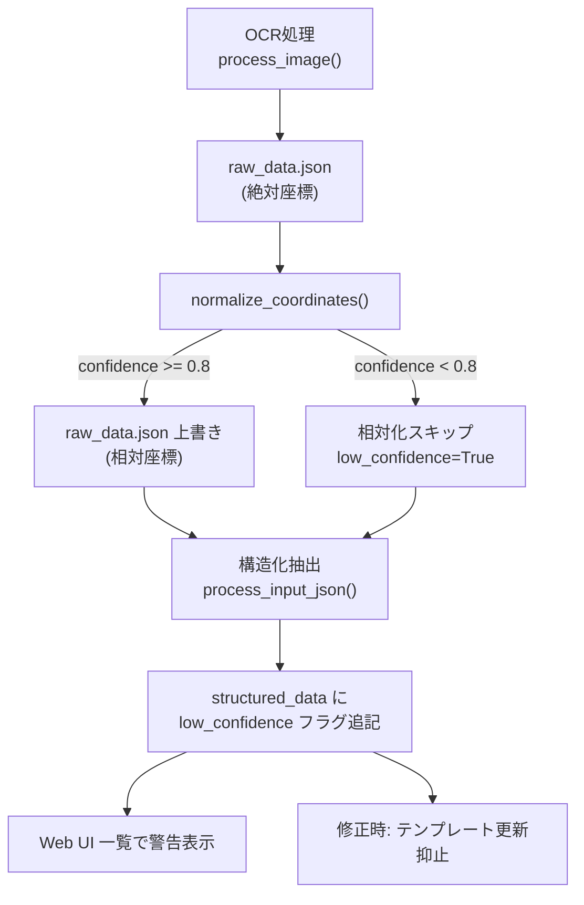

# OCR座標相対化 + Confidenceゲーティング 実装パターン

## 目的

同一クリニックのレシートでも撮影ズレ・余白により座標値が大きく異なる問題を解決する。OCR後の絶対座標を相対座標に変換し、テンプレートマッチングのロバスト性を向上させる。同時にOCR信頼度が低い場合のテンプレート汚染を防ぐ。

## 適用タイミング

- OCRパイプライン（watcher / processor）で raw_data.json 生成後、構造化抽出（process_input_json）の前
- 同一クリニックの複数レシート間で座標ベースのテンプレートマッチングを行う場合
- OCRの confidence 値が利用可能な環境

## アーキテクチャ



## 実装手順

### Step 1: 座標相対化モジュール作成

`app/coord_normalizer.py` を作成し、`normalize_coordinates()` 関数を実装する。

**核となるロジック**:

```python
def _find_min_coords(ocr_entries):
    """全boxの4点から最小x, 最小y, 最上部要素のconfidenceを抽出"""
    min_x = min_y = None
    topmost_confidence = None
    topmost_y = None

    for entry in ocr_entries:
        box = entry.get("box")
        if not box or len(box) < 4:
            continue
        for point in box:
            x, y = point[0], point[1]
            if min_x is None or x < min_x: min_x = x
            if min_y is None or y < min_y: min_y = y
        box_min_y = min(p[1] for p in box)
        if topmost_y is None or box_min_y < topmost_y:
            topmost_y = box_min_y
            topmost_confidence = entry.get("confidence")

    return min_x, min_y, topmost_confidence
```

**confidence チェック**:
- `topmost_confidence` が `None` または `0.8` 未満 → `low_confidence=True` で相対化スキップ
- それ以外 → 全boxから `(min_x, min_y)` を減算し、raw_data.json を上書き

**戻り値**:
```python
{
    "normalized": bool,        # 相対化を実行したか
    "low_confidence": bool,    # 最上部要素の confidence < 0.8
    "topmost_confidence": float|None,
    "offset_x": int,           # 減算した x オフセット
    "offset_y": int,           # 減算した y オフセット
}
```

### Step 2: パイプライン統合

`watcher.py::process_one()` および `processor.py::process_single_image()` の `process_image()` 直後に `normalize_coordinates()` を追加。

```python
from app.coord_normalizer import normalize_coordinates

# 座標相対化（process_image の後、process_input_json の前）
low_confidence = False
try:
    norm_result = normalize_coordinates(output_json_path)
    low_confidence = norm_result.get("low_confidence", False)
except Exception:
    LOG.exception("Coordinate normalization failed")
```

構造化抽出後に low_confidence フラグを structured_data に反映:
```python
if low_confidence:
    structured_data_path = output_dir / f"{stem}-structured_data.json"
    if structured_data_path.exists():
        sd = read_json(structured_data_path)
        sd["low_confidence"] = True
        write_json_atomic(structured_data_path, sd)
```

### Step 3: Web UI 一覧での警告表示

`receipt_service.py::get_all_receipts()` の戻り値に `low_confidence` を追加:
```python
items.append({
    "file_stem": file_stem,
    "display_name": display_name,
    "low_confidence": data.get("low_confidence", False),
})
```

`index.html` で各リンク右に警告表示:
```html
<a href="{{ item.file_stem }}">{{ item.display_name }}</a>

<span style="color: #dc3545; font-size: 12px; margin-left: 8px;">&#9888; 読み取り不十分</span>

```

### Step 4: テンプレート更新ゲーティング

`receipt_updater.py::update_receipt()` で座標フィードバック前に low_confidence をチェック:
```python
low_confidence = old_data.get("low_confidence", False)

# 座標フィードバック（low_confidence 時はスキップ＝テンプレート更新抑止）
feedback_result = None
if not low_confidence:
    feedback_result = self.coord_service.process_feedback(...)
```

## 設計判断ポイント

| 項目 | 判断基準 |
|------|---------|
| 座標計算タイミング | raw_data.json 出力後・上書きが推奨（既存 OCR 関数不変、独立テスト容易） |
| 基準要素 | 最上部（y最小）の confidence を使用。安全側に倒し None も low 扱い |
| 近接値しきい値 | サンプル分析で決定。相対化後も同一クリニック内で50px程度の残差がありうる |
| フラグ永続化 | structured_data.json に追記（Web UI が直接参照可能） |
| テンプレートゲーティング | 座標フィードバック全体をスキップ（corrections は通常通り保存） |

## 注意点（経験則）

### box 座標の探索範囲
- box の4点すべてを探索すること（`box[0]` だけ見ると傾きに対応できない）
- 空リストや不正形式の box はスキップする

### confidence の扱い
- `None` は安全側に倒して `low_confidence=True` とする
- しきい値 0.8 は実装要件に依存（サンプル分析で調整可能）

### パイプライン連鎖の例外安全性
- `normalize_coordinates()` の失敗は OCR 処理の成功を無効にしない
- `try/except` で保護し、エラーはログに記録して処理継続

### 既存テストとの互換性
- `DEFAULT_PROXIMITY_THRESHOLD` 変更時は、同値をアサートする既存テストを更新する
- 全テスト実行で回帰がないことを確認

## テスト計画

### 単体テスト（`tests/test_coord_normalizer.py`）
- 正常系: 複数エントリの座標相対化の正確性
- 異常系: confidence < 0.8 でスキップ + フラグ設定
- エッジケース: 空リスト、単一要素、box 不正、confidence=None、ファイル不存在

### 結合テスト（`tests/test_web.py`）
- 一覧ページでの警告表示確認
- low_confidence レシート修正時のテンプレート更新抑止確認
- corrections テーブルへの反映確認