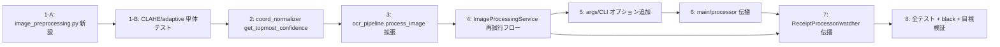

# Issue #36: 実装タスク一覧 — 抽出前の出力向上のための前処理

連携プラン: [plan.md](./plan.md)

## 優先順位・依存関係



**実装順序（推奨）**: Task 1 → 2 → 3 → 4 → 5 → 6 → 7 → 8

このIssueの作業はブランチ `feature/improve-ocr-quality/36`（現在 origin/main より 1 commit 進んでいる）で進める。

---

## Task 1-A: `app/image_preprocessing.py` を新規作成

**優先度: 高** — 前処理の純関数を定義するモジュール（SRP）

### 変更内容

**Create**: `app/image_preprocessing.py`

OCR 前に適用する前処理関数を定義する。入力は単チャネル uint8 のグレースケール画像（`image_resize` が生成する `resized_gray_*` 相当）。

```python
"""Image preprocessing for OCR quality improvement (Issue #36)."""

from __future__ import annotations

from typing import Callable, Optional

import cv2
import numpy as np


def apply_clahe(gray: np.ndarray, clip_limit: float = 2.0, tile_grid_size: tuple[int, int] = (8, 8)) -> np.ndarray:
    """CLAHE（局所コントラスト強調）を適用する。

    Args:
        gray: 単チャネル uint8 グレースケール画像。
        clip_limit: コントラスト制限値。
        tile_grid_size: タイル分割サイズ。

    Returns:
        強調されたグレースケール画像。
    """
    clahe = cv2.createCLAHE(clipLimit=clip_limit, tileGridSize=tile_grid_size)
    return clahe.apply(gray)


def apply_adaptive_threshold(enhanced: np.ndarray, block_size: int = 11, c: int = 2) -> np.ndarray:
    """適応的二値化（影や輝度ムラを低減）を適用する。

    Args:
        enhanced: 単チャネル uint8 グレースケール画像（CLAHE 適用後を想定）。
        block_size: 局所領域のブロックサイズ（奇数）。
        c: しきい値から引く定数。

    Returns:
        二値化画像（0 または 255）。
    """
    return cv2.adaptiveThreshold(
        enhanced,
        255,
        cv2.ADAPTIVE_THRESH_GAUSSIAN_C,
        cv2.THRESH_BINARY,
        block_size,
        c,
    )


def build_preprocess_fn(mode: str) -> Optional[Callable[[np.ndarray], np.ndarray]]:
    """前処理モードに応じた前処理関数を返す。`none` は None を返す。

    Args:
        mode: "none" | "clahe" | "adaptive" | "clahe+adaptive"。

    Returns:
        前処理関数（None の場合は前処理を適用しない）。
    """
    if mode == "none":
        return None
    if mode == "clahe":
        return lambda img: apply_clahe(img)
    if mode == "adaptive":
        return lambda img: apply_adaptive_threshold(img)

    def combined(img: np.ndarray) -> np.ndarray:
        return apply_adaptive_threshold(apply_clahe(img))

    return combined
```

### 注意点
- モジュール冒頭に `from __future__ import annotations`（開発規約）
- Google style docstring
- 型注釈を付ける

**変更ファイル**: `app/image_preprocessing.py`（新規）

---

## Task 1-B: `tests/test_image_preprocessing.py` を追加（TDD）

**優先度: 高**

### Step 1: 失敗テストを書く

**Create**: `tests/test_image_preprocessing.py`

```python
"""Tests for app/image_preprocessing.py (Issue #36)."""

from __future__ import annotations

import cv2
import numpy as np

from app.image_preprocessing import apply_clahe, apply_adaptive_threshold, build_preprocess_fn


def _gray_img(width: int = 64, height: int = 64) -> np.ndarray:
    # 0..255 に分布するランダムグレースケール画像
    return np.random.randint(0, 256, (height, width), dtype=np.uint8)


class TestApplyClahe:
    def test_output_same_shape_and_dtype(self):
        img = _gray_img()
        out = apply_clahe(img)
        assert out.shape == img.shape
        assert out.dtype == np.uint8

    def test_increases_contrast_on_low_contrast_image(self):
        # ほぼ平らな画像（標準偏差が小さい）
        img = np.full((64, 64), 100, dtype=np.uint8)
        img[10:20, 10:20] = 120
        out = apply_clahe(img)
        assert out.std() > img.std()


class TestApplyAdaptiveThreshold:
    def test_output_is_binary(self):
        img = _gray_img()
        out = apply_adaptive_threshold(img)
        assert set(np.unique(out)).issubset({0, 255})
        assert out.shape == img.shape


class TestBuildPreprocessFn:
    def test_none_returns_none(self):
        assert build_preprocess_fn("none") is None

    def test_clahe_returns_callable(self):
        fn = build_preprocess_fn("clahe")
        assert callable(fn)
        assert fn(_gray_img()).shape == (64, 64)

    def test_adaptive_returns_callable(self):
        fn = build_preprocess_fn("adaptive")
        assert callable(fn)
        assert set(np.unique(fn(_gray_img()))).issubset({0, 255})

    def test_combined_returns_callable(self):
        fn = build_preprocess_fn("clahe+adaptive")
        assert callable(fn)
        out = fn(_gray_img())
        assert set(np.unique(out)).issubset({0, 255})
```

### Step 2: 失敗を確認

```bash
uv run pytest tests/test_image_preprocessing.py -v
```

### Step 3: Task 1-A の実装を反映

`app/image_preprocessing.py` を作成済みなら pytest が通る。まだなら作成する。

### Step 4: 成功を確認

```bash
uv run pytest tests/test_image_preprocessing.py -v
# 期待: N passed
```

### Step 5: Commit

```bash
git add app/image_preprocessing.py tests/test_image_preprocessing.py
git commit -m "feat #260929: 前処理 module (CLAHE, adaptiveThreshold) を追加"
```

---

## Task 2: `coord_normalizer.py` に読み取り専用の Confidence 判定を追加

**優先度: 高** — 再試行判定の為に、正規化（box 書き換え）を行わず topmost Confidence を取得する

### Step 1: 失敗テストを追加

**Modify**: `tests/test_coord_normalizer.py`（末尾に追記）

```python
from app.coord_normalizer import get_topmost_confidence


class TestGetTopmostConfidence:
    def test_returns_low_when_below_threshold(self, tmp_path):
        raw = tmp_path / "raw.json"
        raw.write_text(
            json.dumps(
                [
                    {"text": "top", "confidence": 0.5,
                     "box": [[0, 0], [10, 0], [10, 5], [0, 5]]},
                    {"text": "below", "confidence": 0.9,
                     "box": [[0, 20], [30, 20], [30, 25], [0, 25]]},
                ]
            ),
            encoding="utf-8",
        )
        low, conf = get_topmost_confidence(raw)
        assert low is True
        assert conf == 0.5

    def test_returns_not_low_when_above_threshold(self, tmp_path):
        raw = tmp_path / "raw.json"
        raw.write_text(
            json.dumps(
                [
                    {"text": "top", "confidence": 0.95,
                     "box": [[0, 0], [10, 0], [10, 5], [0, 5]]},
                ]
            ),
            encoding="utf-8",
        )
        low, conf = get_topmost_confidence(raw)
        assert low is False
        assert conf == 0.95

    def test_none_confidence_is_low(self, tmp_path):
        raw = tmp_path / "raw.json"
        raw.write_text(json.dumps([{"text": "x", "confidence": None, "box": [[0, 0]]}]), encoding="utf-8")
        low, conf = get_topmost_confidence(raw)
        assert low is True
```

（※ このファイルに `import json` が既にあれば流用。なければ `import json` を追記）

### Step 2: 失敗を確認

```bash
uv run pytest tests/test_coord_normalizer.py::TestGetTopmostConfidence -v
# 期待: FAIL — "cannot import name 'get_topmost_confidence'"
```

### Step 3: 実装

**Modify**: `app/coord_normalizer.py` — 末尾に追加

```python
def get_topmost_confidence(raw_data_path: Path, threshold: float = 0.8) -> tuple[bool, Optional[float]]:
    """読み取り専用で topmost 要素の Confidence がしきい値未満かを判定する。

    Note:
        normalize_coordinates と異なり、box 座標の書き換えは行わない。
        前処理再試行の判定（Issue #36）で使用する。

    Args:
        raw_data_path: raw_data.json のパス。
        threshold: 未満なら低 Confidence とみなすしきい値。

    Returns:
        (low_confidence, topmost_confidence) のタプル。
    """
    import json

    with open(raw_data_path, encoding="utf-8") as f:
        ocr_entries = json.load(f)

    _, _, topmost_confidence = _find_min_coords(ocr_entries)
    low_confidence = topmost_confidence is None or topmost_confidence < threshold
    return low_confidence, topmost_confidence
```

### Step 4: 成功を確認

```bash
uv run pytest tests/test_coord_normalizer.py -v
```

### Step 5: Commit

```bash
git add app/coord_normalizer.py tests/test_coord_normalizer.py
git commit -m "feat #260929: topmost Confidence の読み取り専用判定を追加"
```

---

## Task 3: `ocr_pipeline.process_image` を拡張（前処理・出力先・target_short_side）

**優先度: 高** — 前処理関数適用と前処理済み画像保存をできるようにする

### Step 1: 失敗テストを追加

**Modify**: `tests/test_image_processing_service.py` を編集（`process_image` を直接テストする）か、新規 `tests/test_ocr_pipeline.py` を作成。

**Create**: `tests/test_ocr_pipeline.py`

```python
"""Tests for app/ocr_pipeline.py process_image preprocess extension (Issue #36)."""

from __future__ import annotations

from pathlib import Path
from unittest.mock import Mock, patch

import cv2
import numpy as np

from app.ocr_pipeline import process_image


class TestProcessImagePreprocess:
    def test_writes_preprocessed_image_and_passes_to_ocr(self, tmp_path):
        # 元画像作成（カラー）
        src = tmp_path / "img.jpg"
        cv2.imwrite(str(src), np.full((100, 80, 3), 150, dtype=np.uint8))

        # resize 内部で cv2 実処理を行いたいため、resize を本来どおり使う
        # （process_image は resized_gray_* を生成後、preprocess_fn へ渡す）
        ocr = Mock()
        ocr.predict.return_value = [
            [
                ([[0, 0], [10, 0], [10, 5], [0, 5]], ("top", 0.9)),
            ]
        ]

        preprocessed_out = tmp_path / "processed" / "preprocessed_img.jpg"
        preprocessed_out.parent.mkdir(parents=True, exist_ok=True)

        def fake_preprocess(img):
            return np.where(img > 128, 255, 0).astype(np.uint8)

        structured = process_image(
            src,
            output_dir=tmp_path,
            output_json_path=tmp_path / "raw.json",
            ocr=ocr,
            preprocess_fn=fake_preprocess,
            preprocess_output_path=preprocessed_out,
        )

        assert structured and structured[0]["text"] == "top"
        assert preprocessed_out.exists()
        # predict に渡された画像は前処理済みであるべき
        passed_img = ocr.predict.call_args[0][0]
        assert set(np.unique(passed_img)).issubset({0, 255})
```

### Step 2: 失敗を確認

```bash
uv run pytest tests/test_ocr_pipeline.py -v
# 期待: FAIL — "unexpected keyword argument 'preprocess_fn'"
```

### Step 3: 実装

**Modify**: `app/ocr_pipeline.py`

- インポート部に `from typing import Callable, Optional` を追加
- `process_image` のシグネチャと内部を変更:

```python
def process_image(
    image_path: Path | str,
    output_dir: Path | str,
    output_json_path: Optional[Path | str] = None,
    ocr=None,
    preprocess_fn: Optional[Callable[[np.ndarray], np.ndarray]] = None,
    preprocess_output_path: Optional[Path | str] = None,
    target_short_side: int = 960,
) -> List[dict]:
    """Process a single image: resize, (optional) preprocess, OCR, normalize, write JSON.

    Args:
        image_path: input image path
        output_dir: directory to store resized image
        output_json_path: if provided, write structured JSON to this path
        ocr: optional PaddleOCR instance. If None, caller should supply one.
        preprocess_fn: optional callable applied to the grayscale image before OCR.
        preprocess_output_path: if provided, save the (pre)processed image to this path.
        target_short_side: target short-side size in px for resizing.

    Returns:
        List of dicts with keys: text, confidence, box
    """
    image_path = Path(image_path)
    output_dir = Path(output_dir)
    if not image_path.exists():
        raise FileNotFoundError(f"Image not found: {image_path}")

    resized_path = resize_image_for_ocr(image_path, output_dir, target_short_side=target_short_side)
    if resized_path is None:
        return []

    img = cv2.imread(str(resized_path))

    # Issue #36: 前処理の適用と、処理後画像の保存
    if preprocess_fn is not None:
        img = preprocess_fn(img)
        if preprocess_output_path is not None:
            preprocess_output_path = Path(preprocess_output_path)
            preprocess_output_path.parent.mkdir(parents=True, exist_ok=True)
            cv2.imwrite(str(preprocess_output_path), img)

    if ocr is None:
        raise ValueError("An initialized PaddleOCR instance must be provided as `ocr`")

    results = ocr.predict(img)
    structured = _normalize_results(results)

    if output_json_path:
        from .output import write_json_atomic

        output_json_path = Path(output_json_path)
        write_json_atomic(output_json_path, structured)

    return structured
```

（ctrl-f for `import numpy as np` — `ocr_pipeline.py` には現状 `import numpy` がないため追加のこと）

### Step 4: 成功を確認

```bash
uv run pytest tests/test_ocr_pipeline.py tests/test_image_resize.py -v
```

### Step 5: Commit

```bash
git add app/ocr_pipeline.py tests/test_ocr_pipeline.py
git commit -m "feat #260929: process_image に前処理・保存先・target_short_side を追加"
```

---

## Task 4: `ImageProcessingService` に低Confidence時の前処理再試行を追加

**優先度: 高** — 本Issueの核心フロー（CLI パス）

### Step 1: 失敗テストを追加

**Modify**: `tests/test_image_processing_service.py`（`TestProcess` クラスまたは新クラスに追加）

```python
class TestProcessPreprocessRetry:
    def test_low_confidence_triggers_preprocess_retry_keeps_both_raw(
        self, service, image_path, output_dir, tmp_path
    ):
        mtime = int(image_path.stat().st_mtime)
        raw_path = output_dir / f"receipt-001_{mtime}-raw_data.json"
        preprocessed_raw_path = output_dir / f"receipt-001_{mtime}-raw_data.preprocessed.json"
        processed_dir = tmp_path / "processed"
        processed_dir.mkdir()

        with (
            patch.object(service, "_run_ocr") as mock_ocr,
            patch.object(
                service,
                "_get_topmost_confidence",
                side_effect=[(True, 0.5), (True, 0.7)],  # 1回目→low / 再試行後→まだlow
            ) as mock_conf,
            patch.object(service, "_preprocess_and_retry",
                         return_value=preprocessed_raw_path) as mock_retry,
            patch.object(service, "_normalize_coords", return_value=False) as mock_norm,
            patch.object(service, "_parse_structured") as mock_parse,
            patch.object(service, "_apply_low_confidence_flag") as mock_aug,
        ):
            service.process(
                image_path,
                output_dir,
                model="mock",
                db_path=None,
                processed_dir=processed_dir,
                preprocess_mode="clahe+adaptive",
                target_short_side=960,
            )

        # 低Confidence → 前処理再試行が呼ばれる（原本 raw_data.json は温存）
        mock_retry.assert_called_once()
        # 後段の正規化・パースは前処理済み raw を対象にする
        mock_norm.assert_called_once_with(preprocessed_raw_path)
        mock_parse.assert_called_once_with(
            preprocessed_raw_path, model="mock", output_dir=output_dir, db_path=None
        )
        # 再試行後もまだ低Confidence → flag 付与
        mock_aug.assert_called_once_with(image_path, output_dir, mtime)

    def test_no_preprocess_when_confident(
        self, service, image_path, output_dir, tmp_path
    ):
        mtime = int(image_path.stat().st_mtime)
        raw_path = output_dir / f"receipt-001_{mtime}-raw_data.json"
        processed_dir = tmp_path / "processed"
        processed_dir.mkdir()

        with (
            patch.object(service, "_run_ocr"),
            patch.object(service, "_get_topmost_confidence", return_value=(False, 0.95)),
            patch.object(service, "_preprocess_and_retry") as mock_retry,
            patch.object(service, "_normalize_coords", return_value=False) as mock_norm,
            patch.object(service, "_parse_structured") as mock_parse,
        ):
            service.process(
                image_path, output_dir, model="mock",
                db_path=None, processed_dir=processed_dir,
                preprocess_mode="clahe+adaptive", target_short_side=960,
            )

        mock_retry.assert_not_called()
        # Confidence が十分な場合は原本 raw をそのまま後段へ
        mock_norm.assert_called_once_with(raw_path)
```

### Step 2: 失敗を確認

```bash
uv run pytest tests/test_image_processing_service.py -v
# 期待: FAIL — 新しいメソッド/引数が存在しない
```

### Step 3: 実装

**Modify**: `app/services/image_processing_service.py`

1. 内部ヘルパー `_get_topmost_confidence` を追加:

```python
@staticmethod
def _get_topmost_confidence(output_json_path: Path) -> tuple[bool, Optional[float]]:
    """読み取り専用で topmost Confidence を取得する。"""
    try:
        from app.coord_normalizer import get_topmost_confidence

        return get_topmost_confidence(output_json_path)
    except Exception:
        logger.exception("Failed to check topmost confidence for %s", output_json_path)
        return True, None
```

2. `process()` を再試行フローに変更:

```python
def process(
    self,
    image_path: Path,
    output_dir: Path,
    model: str,
    db_path: Path | str | None = None,
    processed_dir: Optional[Path] = None,
    preprocess_mode: str = "none",
    target_short_side: int = 960,
) -> None:
    """Run the full processing pipeline for a single image.

    Args:
        image_path: Path to the input image file.
        output_dir: Directory for output JSON files.
        model: LLM model name or 'mock' for local heuristic.
        db_path: Optional SQLite database path for persisting results.
        processed_dir: Directory to save preprocessed images (Issue #36).
        preprocess_mode: "none" | "clahe" | "adaptive" | "clahe+adaptive".
        target_short_side: Target short-side size in px for resizing.
    """
    mtime = self._get_mtime(image_path)
    output_json_path = self._make_output_path(image_path, output_dir, mtime)

    # 3. OCR pipeline (1回目: 前処理なし) -> raw_data.json
    self._run_ocr(image_path, output_dir, output_json_path)

    # 4. topmost Confidence 判定（原本 raw_data.json に対して）
    low_confidence, _ = self._get_topmost_confidence(output_json_path)

    # 5. 低Confidence なら前処理で再試行（1回）
    #    原本 raw_data.json は温存し、前処理済み結果を別名(raw_data.preprocessed.json)で保存
    active_raw_path = output_json_path
    if low_confidence and processed_dir is not None and preprocess_mode != "none":
        active_raw_path = self._preprocess_and_retry(
            image_path, output_dir, output_json_path, processed_dir, preprocess_mode, target_short_side
        )
        low_confidence, _ = self._get_topmost_confidence(active_raw_path)

    # 6. 座標正規化（前処理済み raw があればそれを対象に）
    low_confidence = self._normalize_coords(active_raw_path) or low_confidence

    # 7. 構造化パース（前処理済み raw があればそれを対象に）
    self._parse_structured(active_raw_path, model, output_dir, db_path)

    # 8. 低Confidence flag 付与
    if low_confidence:
        self._apply_low_confidence_flag(image_path, output_dir, mtime)
```

3. `_preprocess_and_retry` を追加（原本 raw は温存し、前処理済み raw を別名で保存）:

```python
def _preprocess_and_retry(
    self,
    image_path: Path,
    output_dir: Path,
    output_json_path: Path,
    processed_dir: Path,
    preprocess_mode: str,
    target_short_side: int,
) -> Path:
    """前処理を適用した画像で OCR を再実行し、前処理済み raw JSON を別名保存する。

    Note:
        元の raw_data.json（output_json_path）は上書きせず温存する。
        前処理済みの結果は、{stem}_raw_data.preprocessed.json に保存する。

    前処理済み画像は processed_dir に保存する（目視検証用）。

    Returns:
        前処理済み raw_data のパス。後段の正規化・パースはこれを対象にする。
    """
    from app.image_preprocessing import build_preprocess_fn
    from app.ocr_pipeline import process_image

    preprocessed_path = processed_dir / f"preprocessed_{image_path.name}"
    preprocessed_raw_path = Path(
        str(output_json_path).replace("-raw_data.json", "-raw_data.preprocessed.json")
    )
    preprocess_fn = build_preprocess_fn(preprocess_mode)

    process_image(
        image_path,
        output_dir=output_dir,
        output_json_path=preprocessed_raw_path,
        ocr=self.ocr_engine,
        preprocess_fn=preprocess_fn,
        preprocess_output_path=preprocessed_path,
        target_short_side=target_short_side,
    )
    logger.info(
        "Preprocessed image saved to %s; preprocessed raw saved to %s",
        preprocessed_path,
        preprocessed_raw_path,
    )
    return preprocessed_raw_path
```

※ `_normalize_coords` は現行 3rd step で `_run_ocr` 直後に呼ばれていたが、上では前処理再試行の**後**に呼ぶ様に移動する（再試行後の JSON に基づいて正規化するため）。既存の `TestProcess` 系テスト（`test_happy_path` 等）が `_normalize_coords` の呼び出し順を検証している場合は、`_get_topmost_confidence` 追加に合わせてテスト修正が必要。

### Step 4: 成功を確認

```bash
uv run pytest tests/test_image_processing_service.py -v
```

### Step 5: Commit

```bash
git add app/services/image_processing_service.py tests/test_image_processing_service.py
git commit -m "feat #260929: 低Confidence時に前処理再試行を追加 (CLI パス)"
```

---

## Task 5: CLI オプション追加

**優先度: 中**

### Step 1: 失敗テスト（任意）— `args.py` のテストが存在しないため直接確認

### Step 2: 実装

**Modify**: `app/args.py` — `setup_args()` に以下を追加（`--port` 定義の後）:

```python
parser.add_argument(
    "--preprocess-mode",
    default="none",
    choices=["none", "clahe", "adaptive", "clahe+adaptive"],
    help="低Confidence時に適用する前処理 (Issue #36)。default: none",
)
parser.add_argument(
    "--target-short-side",
    type=int,
    default=960,
    help="リサイズ時、短辺の目標サイズ(px)。default: 960",
)
```

（※ デフォルトを `none` にすることで、既存動作を変えない。検証時は `--preprocess-mode clahe+adaptive` を明示。）

### Step 3: 動作確認

```bash
uv run python main.py --help | grep -E "preprocess-mode|target-short-side"
```

### Step 4: Commit

```bash
git add app/args.py
git commit -m "feat #260929: --preprocess-mode / --target-short-side を追加"
```

---

## Task 6: `main.py` / `processor.py` の引数伝播

**優先度: 中**

### 変更内容

**Modify**: `app/processor.py::process_single_image` — シグネチャと `ImageProcessingService` 呼び出しに以下を追加:

```python
def process_single_image(
    image_name: str,
    input_dir: Path,
    output_dir: Path,
    processed_dir: Path,
    model: str,
    db_path: Path | str | None,
    ocr: PaddleOCR,
    preprocess_mode: str = "none",
    target_short_side: int = 960,
) -> None:
    ...
    service = ImageProcessingService(ocr_engine=ocr)
    service.process(
        image_path, output_dir, model, db_path,
        processed_dir=processed_dir,
        preprocess_mode=preprocess_mode,
        target_short_side=target_short_side,
    )
```

**Modify**: `main.py` — `process_single_image` 呼び出しに `processed_dir` / `preprocess_mode` / `target_short_side` を渡す:

```python
process_single_image(
    image_name=args.image_name,
    input_dir=input_dir,
    output_dir=output_dir,
    processed_dir=processed_dir,
    model=args.model,
    db_path=args.db_path,
    ocr=ocr,
    preprocess_mode=args.preprocess_mode,
    target_short_side=args.target_short_side,
)
```

### 検証

```bash
uv run pytest tests/test_e2e_structured_outputs.py -v 2>/dev/null || true
black app/processor.py main.py
```

### Commit

```bash
git add app/processor.py main.py
git commit -m "feat #260929: CLI → サービスの前処理引数を伝播"
```

---

## Task 7: watcher パス（`ReceiptProcessor` / `watcher.py`）にも前処理を実装

**優先度: 中** — watch 時のポーリング/watchdog 処理にも適用する

### 変更内容

**Modify**: `app/services/receipt_processor.py` — コンストラクタに `preprocess_mode` / `target_short_side` を追加し、`_sync_process` の座標正規化判定部分で低Confidence時に `process_image` へ前処理を渡して再実行（1回）する。

- `ReceiptProcessor.__init__` に `processed_dir` / `preprocess_mode: str = "none"` / `target_short_side: int = 960` を追加
- `_sync_process` 内部:
  - `normalize_coordinates` による `low_confidence` 判定の前に、`get_topmost_confidence` で読み取り専用判定
  - 低Confidence → `process_image(..., preprocess_fn=fb, preprocess_output_path=processed_dir/..., target_short_side=...)` で再実行し、**前処理済み raw は `-raw_data.preprocessed.json` に別名保存**（原本 `raw_data.json` は温存） → `normalize_coordinates` は前処理済み raw を対象に再実行
  - 原本 raw と前処理済み raw の両方を残して比較可能にする（Task 4 と同設計）

**Modify**: `app/watcher.py` — `process_one` / `scan_and_process` / `run_loop` / `run_watchdog` に `preprocess_mode` / `target_short_side` パラメータを追加し、`ReceiptProcessor` 生成時に渡す。`__main__` / `main.py` からも伝播する（`main.py` の `run_loop`/`run_watchdog` 呼び出しへ追加）。

（※ ロジックは Task 4 と同様。重複を避けるため、可能なら前処理再試行を共通ヘルパーへ抽出する。ただし本Issueでは最小変更を優先し、両サービスに同じ前処理呼び出しを実装する。）

### 補足
- `watcher.py` のテストは `tests/test_watcher_integration.py` / `tests/test_receipt_processor.py`。

### Commit

```bash
git add app/services/receipt_processor.py app/watcher.py main.py
git commit -m "feat #260929: watcher パスに前処理再試行を伝播"
```

---

## Task 8: 全テスト + 整形 + 目視検証

**優先度: 高**

### Step 1: 全テスト

```bash
uv run pytest
# 期待: 全て Pass
```

### Step 2: black 整形

```bash
black .
```

### Step 3: 目視検証（サンプル領収書）

```bash
uv run python main.py --input-dir ~/Downloads/receipts --image-name <低Confidenceな領収書>.jpg \
    --processed-dir processed --preprocess-mode clahe+adaptive --target-short-side 960
```

確認項目:
- `processed/preprocessed_<画像>.jpg` が生成される
- 目視で文字が CLAHE/二値化により強調されている
- `output_json/<stem>_<mtime>-raw_data.json`（前処理なし）と `output_json/<stem>_<mtime>-raw_data.preprocessed.json`（前処理済み）の **2ファイル** が生成され、topmost Confidence が前後で比較・改善しているか記録

`--preprocess-mode` を `clahe` / `adaptive` / `clahe+adaptive` / `none` と切り替えて比較し、どの組み合わせが最良かを検証結果に残す。

### Step 4: 結果の記録

検証結果を本ファイル末尾（実装メモ欄）または `docs/architecture/` に追記し、次 Issue 判断材料にする。

---

## 実装メモ（作業中の結果記録用）

| 日時 | 検証内容 | 結果 | 補足 |
|------|----------|------|------|
| 2026-09-29 | 前処理 module (CLAHE/adaptive/build_preprocess_fn) | 7 passed | `tests/test_image_preprocessing.py` |
| 2026-09-29 | coord_normalizer.get_topmost_confidence 追加 | 17 passed | `tests/test_coord_normalizer.py` |
| 2026-09-29 | ocr_pipeline.process_image 前処理・保存先・target_short_side | 2 passed | `tests/test_ocr_pipeline.py` |
| 2026-09-29 | ImageProcessingService 前処理再試行 (CLI パス) | 18 passed (1 pre-existing fail) | `tests/test_image_processing_service.py`。`test_calls_process_image_and_logs` は caplog が INFO を捕捉しない既存失敗 (origin/main でも失敗) |
| 2026-09-29 | args CLI オプション (`--preprocess-mode` / `--target-short-side`) | --help で表示確認 | `app/args.py` |
| 2026-09-29 | main/processor 引数伝播 | import 確認 OK | |
| 2026-09-29 | watcher パス (ReceiptProcessor / watcher.py) 伝播 | 9 passed | `tests/test_receipt_processor.py` `tests/test_watcher_integration.py` |
| 2026-09-29 | 全テスト | 182 passed / 1 pre-existing fail | 5 commit |
| 2026-09-29 | 目視検証 | **未実施（要ユーザー画像）** | サンプル領収書画像がリポジトリ/no ~/Downloads/receipts に存在しないため。`--preprocess-mode clahe+adaptive` で実施予定 |

---

## ファイル変更サマリ

| ファイル | Task | 変更種別 |
|----------|------|----------|
| `app/image_preprocessing.py` | 1-A | 新規 |
| `tests/test_image_preprocessing.py` | 1-B | 新規 |
| `app/coord_normalizer.py` | 2 | 修正（追加） |
| `tests/test_coord_normalizer.py` | 2 | 修正（追加） |
| `app/ocr_pipeline.py` | 3 | 修正 |
| `tests/test_ocr_pipeline.py` | 3 | 新規 |
| `app/services/image_processing_service.py` | 4 | 修正 |
| `tests/test_image_processing_service.py` | 4 | 修正（追加） |
| `app/args.py` | 5 | 修正（追加） |
| `app/processor.py`, `main.py` | 6 | 修正 |
| `app/services/receipt_processor.py`, `app/watcher.py` | 7 | 修正 |
