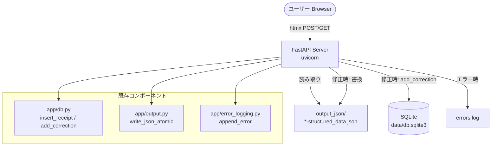

# Issue #20: アーキテクチャ設計

## システム構成



## ディレクトリ構造（追加分）

```
app/web/                        # Web UI パッケージ（新規）
├── __init__.py
├── server.py                   # FastAPI アプリケーション本体
└── templates/                  # Jinja2 テンプレート
    ├── index.html              # 一覧ページ
    └── detail.html             # 詳細（編集）ページ

tasks/issue_20/                 # 本計画ドキュメント
├── overview.md
├── architecture.md
├── tasks.md
└── test_plan.md
```

## データフロー詳細

### トップページ表示 (`GET /`)

1. `server.py` が `output_json/` ディレクトリをスキャン
2. `*-structured_data.json` ファイルを検出
3. 各ファイルの JSON を読み取り、表示名 `{clinic}-{date}` を生成
   - clinic または date が null の場合はファイル名をフォールバック表示
4. 一覧を Jinja2 テンプレートに渡して HTML レンダリング
5. htmx なしの通常遷移でレスポンス

### 詳細ページ表示 (`GET /{file_stem}`)

1. `output_json/{file_stem}-structured_data.json` を読み取り
2. ラベルマッピングを適用:
   - `name` → 「氏名」
   - `clinic` → 「クリニック名(調剤薬局名)」
   - `amount` → 「支払い金額」
   - `date` → 「発行日」
3. 座標情報は一切含めない
4. 編集フォーム（テキストボックス）+ 「修正」「戻る」ボタンを含むHTMLを返却

### 修正処理 (`PUT /{file_stem}`) — htmx

1. フォームから htmx が `PUT` リクエストを送信
2. `server.py` が以下を実行:

   ```
   a. JSON ファイルから現在値を読み取り（old_value 検証用）
   b. DB に receipt が存在するか確認
      - 存在する場合: add_correction() で修正を記録
      - 存在しない場合: insert_receipt() で登録後、add_correction()
   c. write_json_atomic() で JSON ファイルを更新
   d. エラー時: append_error() で記録し、処理継続
   e. 更新後の値を含む HTML 断片を htmx に返却（ページ遷移なし）
   ```

## ルーティング

| メソッド | パス | 説明 | htmx |
|---------|------|------|------|
| GET | `/` | トップページ（一覧） | なし |
| GET | `/{file_stem}` | 詳細（編集）ページ | なし |
| PUT | `/{file_stem}` | 修正実行 | あり（部分更新） |

## 既存コードの再利用箇所

| 機能 | 使用モジュール | 関数 |
|------|--------------|------|
| DB 接続・CRUD | `app/db` | `get_db_connection`, `insert_receipt`, `get_receipt`, `add_correction`, `get_or_create_clinic` |
| JSON 書き込み | `app/output` | `write_json_atomic` |
| エラーログ | `app/error_logging` | `append_error` |
| JSON 読み取り | `app/input` | `read_json` |