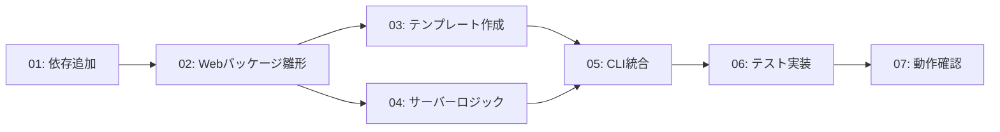

# Issue #20: 実装タスク一覧

## 優先順位・依存関係



---

## タスク 01: 依存関係の追加

**優先度: 高** — 他の全タスクの前提

- `pyproject.toml` に以下を追加:
  - `fastapi>=0.115.0`
  - `uvicorn[standard]>=0.34.0`
  - `jinja2>=3.1.0`
- `uv sync` または `uv add` でインストール確認

**ファイル変更**: `pyproject.toml`

---

## タスク 02: Web UI パッケージの雛形作成

**優先度: 高**

- `app/web/__init__.py` を作成（空でも可）
- `app/web/server.py` を作成（後続タスクで実装）
- `app/web/templates/` ディレクトリを作成
- `main.py` からの起動方式を確認（後続タスクで実装）

**新規ファイル**:
- `app/web/__init__.py`
- `app/web/server.py`（雛形：FastAPI インスタンスのみ）

---

## タスク 03: Jinja2 テンプレート作成

**優先度: 中** — テンプレート先行作成が可能

### 03-a: `index.html` — 一覧ページ

- `output_json/` の structured_data JSON 一覧をテーブル or リスト表示
- 各行に詳細ページへのリンク
- 表示名: `{clinic}-{date}`（clinic がない場合はファイル名）
- 空の場合は「データがありません」表示

**テンプレート変数**:
```python
{
  "items": [
    {
      "file_stem": "receipt-20260101-001",
      "display_name": "あおばクリニック-2026-01-15",
      "clinic": "あおばクリニック",
      "date": "2026-01-15"
    },
    ...
  ]
}
```

### 03-b: `detail.html` — 詳細（編集）ページ

- ラベル: 値 形式で必要データを表示（座標は非表示）
- ラベルマッピング:
  - `氏名:` → `name`
  - `クリニック名(調剤薬局名):` → `clinic`
  - `支払い金額:` → `amount`
  - `発行日:` → `date`
- 各値は編集可能なテキストボックス
- 「修正」ボタン: htmx `PUT /{file_stem}` を発行
- 「戻る」ボタン: `GET /` に遷移
- htmx の `hx-target`, `hx-swap` を使用し、修正後に当該行を置換

**テンプレート変数**:
```python
{
  "file_stem": "receipt-20260101-001",
  "fields": {
    "name": {"label": "氏名", "value": "山田 太郎"},
    "clinic": {"label": "クリニック名(調剤薬局名)", "value": "あおばクリニック"},
    "amount": {"label": "支払い金額", "value": 3800},
    "date": {"label": "発行日", "value": "2026-01-15"}
  }
}
```

**新規ファイル**:
- `app/web/templates/index.html`
- `app/web/templates/base.html`（共通レイアウト、オプション）
- `app/web/templates/detail.html`

---

## タスク 04: FastAPI サーバーロジックの実装

**優先度: 高**

### 04-a: 一覧エンドポイント `GET /`

- `output_json/` ディレクトリを走査
- `*-structured_data.json` ファイルを glob で収集
- 各ファイルの JSON を読み取り、表示名を生成
- `index.html` にデータを渡してレンダリング
- JSON 読み取り失敗ファイルはスキップ（エラーログ出力）

### 04-b: 詳細エンドポイント `GET /{file_stem}`

- `output_json/{file_stem}-structured_data.json` を読み取り
- ラベルマッピングを適用
- `detail.html` にデータを渡してレンダリング
- ファイルが存在しない場合: 404 応答

### 04-c: 修正エンドポイント `PUT /{file_stem}`

1. リクエストボディから修正値を取得
2. 現在の JSON ファイルを読み取り（old_value 取得）
3. DB 処理:
   - `db_path` が設定されている場合のみ実行
   - receipt が存在するか確認（`source_path` で検索 or 新規登録）
   - `add_correction()` を呼び出し（field_name ごとに）
   - エラー時: `append_error()` + 処理継続
4. JSON ファイル更新:
   - `normalize_extracted()` で金額・日付を正規化
   - `write_json_atomic()` でファイル書き換え
5. htmx 応答: 更新後の値を含む HTML 断片を返却（`hx-swap` で置換）

### 04-d: uvicorn 起動設定

```python
if __name__ == "__main__":
    import uvicorn
    uvicorn.run(app, host=host, port=port)
```

**実装ファイル**: `app/web/server.py`

---

## タスク 05: CLI 統合（main.py + args.py）

**優先度: 中**

### 05-a: `app/args.py` に引数追加

```python
parser.add_argument("--serve", action="store_true", help="Start Web UI server")
parser.add_argument("--host", default="127.0.0.1", help="Web server host")
parser.add_argument("--port", type=int, default=8000, help="Web server port")
```

### 05-b: `main.py` の分岐追加

```python
if args.serve:
    import uvicorn
    from app.web.server import app
    print(f"Starting Web UI at http://{args.host}:{args.port}")
    uvicorn.run(app, host=args.host, port=args.port, log_level="info")
    return
```

**ファイル変更**:
- `app/args.py`
- `main.py`

---

## タスク 06: テスト実装

**優先度: 高** — 受入条件に含む

詳細は `test_plan.md` 参照。要点:
- FastAPI TestClient を使用
- モック JSON ファイル + temp SQLite DB で検証
- 一覧表示・詳細表示・修正反映・エラーケースを網羅

**新規ファイル**:
- `tests/test_web.py`

---

## タスク 07: 動作確認

**優先度: 中**

- `uv sync` で依存関係インストール確認
- `pytest tests/test_web.py -v` で全テストパス確認
- `uv run main.py --serve` でサーバー起動確認
- `uv run main.py --serve --db-path data/db.sqlite3` でDB連携確認
- `black .` でフォーマット確認

---

## 実装順序（推奨）

```
01: 依存追加
  ↓
02: Webパッケージ雛形
  ↓
03-a: 一覧テンプレート
  ↓
04-a: 一覧エンドポイント + 04-b: 詳細エンドポイント
  ↓
03-b: 詳細テンプレート
  ↓
04-c: 修正エンドポイント
  ↓
04-d: uvicorn起動 + 05: CLI統合
  ↓
06: テスト実装 → 07: 動作確認
```