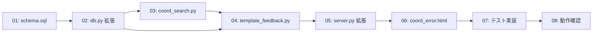

# Issue #22: 実装タスク一覧

## 優先順位・依存関係



---

## タスク 01: schema.sql に template_history テーブル追加

**優先度: 高** — DB依存の前提

- `docs/schema.sql` に `template_history` テーブル定義を追加
- カラム: id, template_id, clinic_id, version, coords_corrections, changed_fields, change_reason, receipt_id, created_at
- 外部キー: templates, clinics, receipts（SET NULL）

**変更ファイル**: `docs/schema.sql`

---

## タスク 02: app/db.py 拡張

**優先度: 高**

### 02-a: `get_receipt_by_source_path(db_path, source_path) -> Optional[dict]`

- `source_path` で `receipts` テーブルを検索
- `ocr_json` と `normalized_json` を JSON デコードして返却

### 02-b: `get_latest_template_by_clinic(db_path, clinic_id) -> Optional[dict]`

- `templates` テーブルから `clinic_id` に一致する最新（`version DESC LIMIT 1`）を取得
- `coords_corrections` を JSON デコードして返却

### 02-c: `insert_template_history(db_path, ...) -> None`

- `template_history` テーブルに履歴レコードを挿入
- `coords_corrections` は JSON シリアライズして保存

**変更ファイル**: `app/db.py`

---

## タスク 03: app/coord_search.py 実装

**優先度: 高**

### 03-a: `search_coordinates(ocr_entries, query, threshold=0.7) -> Optional[list]`

- OCRエントリリストから `query` に類似するテキストを `difflib.SequenceMatcher` で検索
- 最一致エントリの `box` 座標を返却
- しきい値未満は `None`

### 03-b: `search_coordinates_multi(ocr_entries, field_map, threshold=0.7) -> dict`

- 複数フィールドの一括検索
- `field_map: {field_name: query_string}` → `{field_name: box_or_None}`

**新規ファイル**: `app/coord_search.py`

---

## タスク 04: app/template_feedback.py 実装

**優先度: 高**

### `process_correction_feedback(db_path, clinic_id, field_coords_map, receipt_id=None) -> dict`

1. `field_coords_map` から有効な座標を持つフィールドを抽出
2. `get_latest_template_by_clinic()` で現在のテンプレートを取得（なければ新規）
3. 対象フィールドの座標をマージ更新
4. `upsert_template()` でテンプレート保存（新規の場合は作成）
5. `insert_template_history()` で更新前スナップショットを保存
6. 戻り値: `{updated_fields: [...], not_found_fields: [...], history_id: str | None}`

**注意**: FK制約を回避するため `upsert_template` を先に実行し、その後 `insert_template_history` を実行する。

**新規ファイル**: `app/template_feedback.py`

---

## タスク 05: app/web/server.py PUT エンドポイント拡張

**優先度: 高**

### 既存の `update_item` に以下を追加

1. imports 追加: `coord_search`, `template_feedback`, `get_receipt_by_source_path`
2. 修正フィールドの各 `old_value` に対して:
   - `get_receipt_by_source_path()` で ocr_json を取得
   - `search_coordinates()` で座標検索
   - クリニックIDを特定（必要に応じて `get_or_create_clinic`）
   - `process_correction_feedback()` を呼び出し
3. `not_found_fields` が存在する場合、`coord_error.html` をレンダリング

### エラーハンドリング

- 座標FB全体を `try/except` でラップし、失敗時も通常の修正処理は継続
- エラー内容は `append_error()` で errors.log に記録

**変更ファイル**: `app/web/server.py`

---

## タスク 06: coord_error.html 作成

**優先度: 中**

- 座標未検出フィールドの一覧表示
- 考えられる原因の表示
- 更新された値の確認表示
- 詳細ページへの「戻る」リンク

**新規ファイル**: `app/web/templates/coord_error.html`

---

## タスク 07: テスト実装

**優先度: 高** — 受入条件に含む

### 07-a: `tests/test_coord_search.py` — 座標検索の単体テスト

| テスト | 概要 |
|--------|------|
| test_exact_match | 完全一致で正しい座標が返る |
| test_similar_match | 類似度マッチング（閾値調整）で座標取得 |
| test_no_match | 存在しないテキストは None |
| test_empty_query | 空クエリは None |
| test_empty_entries | 空リストは None |
| test_high_threshold_rejects | 高閾値で緩いマッチが棄却される |
| test_low_threshold_accepts | 低閾値で緩いマッチが許容される |
| test_multiple_candidates_best_match | 複数候補から最類似を選択 |
| test_multi_search | 複数フィールド一括検索 |
| test_multi_search_partial_missing | 一部フィールド欠落時の動作 |
| test_multi_search_empty | 空エントリでの動作 |

### 07-b: `tests/test_feedback.py` — フィードバック結合テスト

| テスト | 概要 |
|--------|------|
| test_updates_template_with_coords | 座標→テンプレート反映＋履歴保存 |
| test_partial_update_keeps_old_coords | 部分更新で既存座標維持 |
| test_no_match_fields | 全フィールド None で更新スキップ |
| test_no_existing_template_creates_new | 未作成クリニックで新規テンプレート作成 |
| test_feedback_updates_template_on_correction | E2E: PUT→座標FB→テンプレート更新 |
| test_feedback_error_page_on_no_match | E2E: 座標なし→エラーページ |
| test_no_db_no_feedback | DBなし→通常修正継続 |
| test_receipt_without_ocr_json | ocr_jsonなし→FBスキップ |

**新規ファイル**:
- `tests/test_coord_search.py`
- `tests/test_feedback.py`

---

## タスク 08: 動作確認

**優先度: 中**

```bash
# 全テスト実行
source .venv/bin/activate
pytest tests/test_coord_search.py tests/test_feedback.py tests/test_web.py -v

# フォーマット確認
black --target-version py311 --check .

# サーバー起動確認
uv run main.py --serve --db-path data/db.sqlite3
```

---

## 実装順序（推奨）

```
01: schema.sql
  ↓
02: db.py 拡張
  ↓
03: coord_search.py
  ↓
04: template_feedback.py
  ↓
05: server.py 拡張
  ↓
06: coord_error.html
  ↓
07-a: test_coord_search.py
  ↓
07-b: test_feedback.py
  ↓
08: 動作確認
```