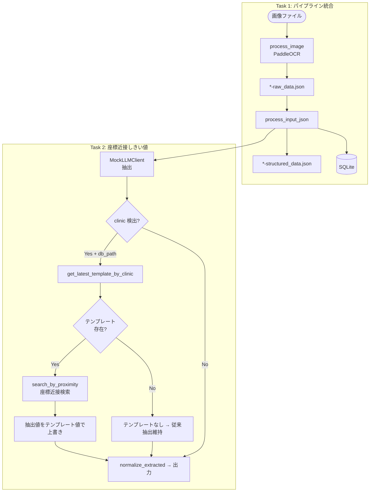

# Issue #24: アーキテクチャ設計

## 全体データフロー



## モジュール構成

### 変更モジュール

| モジュール | 変更内容 |
|-----------|---------|
| `app/watcher.py` | `process_one()` / `scan_and_process()` / `run_loop()` / `run_watchdog()` に `model`, `db_path` 引数を追加。OCR 完了後に `process_input_json()` を呼び出す |
| `app/processor.py` | `process_single_image()` で OCR 完了後に `process_input_json()` を呼び出す |
| `app/main.py` | watcher 起動時に `model`, `db_path` を伝播 |
| `app/coord_search.py` | 座標近接検索関数 `search_by_proximity()`, `search_by_proximity_multi()` を追加 |
| `app/structural_parser.py` | `process_input_json()` 内でテンプレート連携ロジックを追加（MockLLMClient 時のみ） |

### 変更しないモジュール

| モジュール | 理由 |
|-----------|------|
| `app/db.py` | 必要な関数（`get_latest_template_by_clinic`, `get_or_create_clinic`）は既存 |
| `app/web/server.py` | Web UI の修正処理は変更不要 |
| `app/template_feedback.py` | 既存のフィードバック機構はそのまま |
| `app/services/receipt_service.py` | サービス層の更新処理は変更不要 |
| `docs/schema.sql` | スキーマ変更不要 |

## データ構造

### 座標近接検索アルゴリズム

```
入力:
  - ocr_entries: [{text, confidence, box: [[x1,y1],[x2,y2],[x3,y3],[x4,y4]]}, ...]
  - target_box: [[x1,y1],[x2,y2],[x3,y3],[x4,y4]]  (テンプレートの座標)
  - threshold: 20px

処理:
  1. target_box の中心座標を計算: cx = (x1+x3)/2, cy = (y1+y3)/2
  2. 各 OCR エントリの box 中心を計算
  3. ユークリッド距離: dist = sqrt((cx-ocr_cx)² + (cy-ocr_cy)²)
  4. 最小距離が threshold 以内 → 該当エントリを返す
  5. 最小距離が threshold 超過 → None を返す

出力:
  - 該当 OCR エントリの dict (text, confidence, box) または None
```

### テンプレート連携フロー（`process_input_json` 内）

```
1. MockLLMClient.extract_fields() → extracted (name, clinic, amount, date)
2. extracted["clinic"] が存在 + db_path が設定されている
   ↓
3. get_or_create_clinic(db_path, clinic_name) → clinic_id
4. get_latest_template_by_clinic(db_path, clinic_id)
   ↓
5. テンプレートの coords_corrections が存在する場合:
   5a. search_by_proximity_multi(ocr_entries, field_box_map, threshold=20)
   5b. マッチしたフィールドは extracted を上書き
6. normalize_extracted → write → DB persistence (従来のフロー)
```

## エラーハンドリング

| シナリオ | 対応 |
|---------|------|
| process_input_json が失敗 | `append_error()` で記録し、watcher/processor は処理継続（ファイルは processed へ移動） |
| テンプレート連携が失敗 | `append_error()` で記録し、従来の抽出結果を使用 |
| クリニック未検出 | テンプレート連携をスキップ、そのまま従来フロー |
| テンプレート存在しない or 空 | スキップ、従来フロー |
| DB 未接続 (db_path=None) | テンプレート連携をスキップ、従来フロー |
