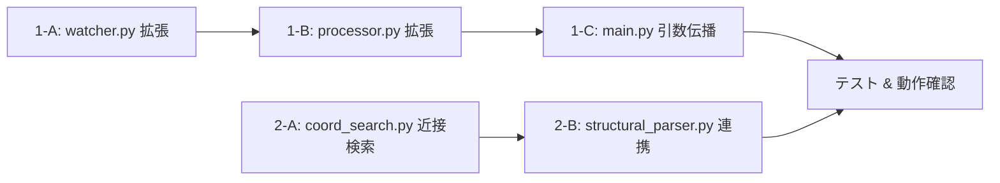

# Issue #24: 実装タスク一覧

## 優先順位・依存関係



---

## Task 1-A: watcher.py の拡張 — process_input_json 呼び出し

**優先度: 高** — パイプライン統合の要

### 変更内容

`process_one()` に `model` / `db_path` パラメータを追加し、`process_image()` 成功後に `process_input_json()` を呼び出す。

`scan_and_process()`, `run_loop()`, `run_watchdog()` も同様にパラメータを追加して伝播させる。

### 処理フロー（`process_one` 内）

```
1. process_image() → output_json_path (raw_data.json) [既存]
   ↓ (成功時)
2. process_input_json(
       output_json_path,
       model=model,
       output_dir=output_dir,
       db_path=db_path,
   )
   ↓
3. 画像ファイルを processed_dir へ移動 [既存]
```

### 注意点

- `process_input_json()` が失敗しても、画像ファイルの移動は継続する（処理済みとして扱う）
- `process_input_json()` 内でのエラーは `append_error()` で記録されるため、watcher 側での特別なエラーハンドリングは不要
- 出力 JSON が既に存在する場合のスキップ処理は既存の仕組み（`output_json_path.exists()` チェック）がそのまま機能する

**変更ファイル**: `app/watcher.py`

---

## Task 1-B: processor.py の拡張 — single-image モード対応

**優先度: 高**

### 変更内容

`process_single_image()` で `process_image()` 成功後に `process_input_json()` を呼び出す。

`process_input_json()` は `args.model`, `args.db_path`, `output_dir` を使用する。raw_data.json のパスは `output_json_path` 変数（既存）。

**変更ファイル**: `app/processor.py`

---

## Task 1-C: main.py の引数伝播

**優先度: 高**

### 変更内容

watcher 起動箇所（`run_loop` / `run_watchdog`）に `model` と `db_path` を渡す:

```python
if args.use_watchdog:
    watcher.run_watchdog(
        input_dir, output_dir, processed_dir, failed_dir,
        poll_interval=args.poll_interval,
        retries=args.retries,
        model=args.model,
        db_path=args.db_path,
    )
else:
    watcher.run_loop(
        input_dir, output_dir, processed_dir, failed_dir,
        poll_interval=args.poll_interval,
        run_once=False,
        retries=args.retries,
        model=args.model,
        db_path=args.db_path,
    )
```

**変更ファイル**: `app/main.py`

---

## Task 2-A: coord_search.py に座標近接検索を追加

**優先度: 高** — Task2 の基盤

### 追加関数

#### `_calculate_box_center(box: List[List[int]]) -> Tuple[float, float]`

box4点座標から中心座標を計算:
- `cx = (box[0][0] + box[2][0]) / 2.0`  （左上x + 右下x）/ 2
- `cy = (box[0][1] + box[2][1]) / 2.0`  （左上y + 右下y）/ 2

#### `_euclidean_distance(p1: Tuple[float, float], p2: Tuple[float, float]) -> float`

2点間のユークリッド距離:
- `sqrt((p1[0] - p2[0])**2 + (p1[1] - p2[1])**2)`

#### `search_by_proximity(ocr_entries: List[dict], target_box: List[List[int]], threshold: float = 20.0) -> Optional[dict]`

テンプレートの座標に最も近い OCR エントリを検索:

1. `target_box` の中心座標を計算
2. 各 OCR エントリの box 中心との距離を計算
3. 最小距離が `threshold` 以内 → 該当エントリ全体を返す
4. 該当なし → None

戻り値: `{"text": ..., "confidence": ..., "box": ...}` または `None`

#### `search_by_proximity_multi(ocr_entries: List[dict], field_box_map: dict[str, List[List[int]]], threshold: float = 20.0) -> dict[str, Optional[dict]]`

複数フィールド一括検索。戻り値は `{field_name: entry_or_None}`。

### テストケース（`test_coord_search.py` に追加）

| テスト | 概要 |
|--------|------|
| `test_search_by_proximity_exact` | 同一座標で正しくマッチ |
| `test_search_by_proximity_within_threshold` | しきい値内のズレでマッチ |
| `test_search_by_proximity_beyond_threshold` | しきい値超過で None |
| `test_search_by_proximity_empty_entries` | 空エントリで None |
| `test_search_by_proximity_empty_target` | 空 box で None |
| `test_search_by_proximity_nearest_match` | 複数候補から最小距離を選択 |
| `test_search_by_proximity_multi` | 複数フィールド一括検索 |
| `test_search_by_proximity_multi_partial` | 一部フィールドのみマッチ |

**変更ファイル**: `app/coord_search.py`, `tests/test_coord_search.py`

---

## Task 2-B: structural_parser.py の拡張 — テンプレート連携

**優先度: 高**

### 変更内容

`process_input_json()` 内で、MockLLMClient 抽出後に以下の処理を追加:

```python
# --- テンプレート連携 (MockLLMClient 時のみ) ---
template_extracted = None
if model == "mock" and db_path and extracted.get("clinic"):
    try:
        clinic_name = str(extracted["clinic"]).strip()
        if clinic_name:
            clinic_id = get_or_create_clinic(db_path, clinic_name)
            template = get_latest_template_by_clinic(db_path, clinic_id)
            coords = template.get("coords_corrections") if template else None
            if coords:
                # ocr_entries を準備
                ocr_entries = ocr_json
                if isinstance(ocr_json, dict) and "words" in ocr_json:
                    ocr_entries = ocr_json.get("words", [])
                elif isinstance(ocr_json, dict) and "text_lines" in ocr_json:
                    # text_lines は単なる文字列リスト → dict 形式に変換
                    ocr_entries = [{"text": t} for t in ocr_json["text_lines"]]

                # 近接検索
                proximity_results = search_by_proximity_multi(
                    ocr_entries, coords, threshold=DEFAULT_PROXIMITY_THRESHOLD,
                )
                # マッチしたフィールドを抽出値として上書き
                for field_name, match in proximity_results.items():
                    if match and match.get("text"):
                        extracted[field_name] = match["text"]
    except Exception as e:
        append_error(output_dir, str(input_path), str(e), "template_proximity", {})
```

**定数追加**: `DEFAULT_PROXIMITY_THRESHOLD = 20.0` をファイル先頭に定義

**注意点**:
- テンプレート連携全体を `try/except` で保護 → 失敗時は従来の抽出結果を維持
- ocr_entries は `ocr_pipeline.py::_normalize_results()` の出力形式（`[{text, confidence, box}]`）を前提
- text_lines 形式（単なる文字列リスト）の場合は box がないため近接検索できない → スキップ

### テストケース

新規ファイル `tests/test_structural_parser.py`:

| テスト | 概要 |
|--------|------|
| `test_process_input_json_creates_structured_json` | raw_data.json → structured_data.json 生成 |
| `test_template_based_extraction_override` | テンプレート座標から抽出値が取得でき、MockLLMClient 結果を上書き |
| `test_template_no_match_falls_back` | テンプレートマッチなし → 通常 MockLLMClient 抽出 |
| `test_template_without_db_skips` | db_path=None でテンプレート連携がスキップされる |
| `test_template_without_clinic_skips` | clinic 未検出でテンプレート連携がスキップされる |

**変更ファイル**: `app/structural_parser.py`
**新規ファイル**: `tests/test_structural_parser.py`

---

## テスト計画（全体）

| ファイル | テストケース数 | 内容 |
|----------|--------------|------|
| `tests/test_coord_search.py` | 8 追加 | 座標近接検索の単体テスト |
| `tests/test_structural_parser.py` | 5 新規 | テンプレート連携 + パイプラインテスト |
| `tests/test_watcher_integration.py` | 1-2 追加 | watcher → structured_data 生成確認 |

### 動作確認

```bash
# 全テスト実行
pytest tests/test_coord_search.py tests/test_structural_parser.py tests/test_watcher_integration.py tests/test_web.py tests/test_feedback.py -v

# フォーマット確認
black --check .

# 単体テストのみ
pytest tests/test_coord_search.py::test_search_by_proximity_exact -v
```

---

## 実装順序（推奨）

```
1-A: watcher.py 拡張 (model/db_path 追加 + process_input_json呼び出し)
  ↓
1-B: processor.py 拡張 (process_input_json呼び出し)
  ↓
1-C: main.py 引数伝播
  ↓ (ここでパイプラインの自動連鎖が完了)
2-A: coord_search.py 近接検索関数追加 + 単体テスト
  ↓
2-B: structural_parser.py テンプレート連携 + 単体テスト
  ↓
全テスト実行 + 動作確認
  ↓
black .
```
