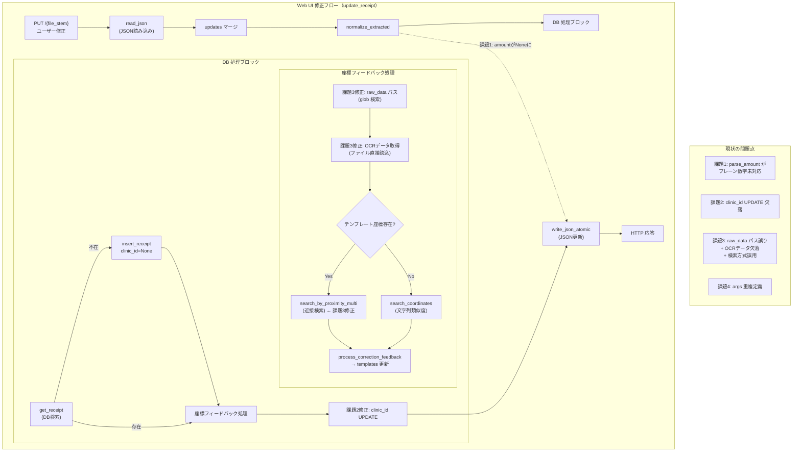

# Issue #26: アーキテクチャ設計

## 全体データフロー（Web UI 修正処理）



## モジュール構成

### 変更モジュール

| モジュール | 変更内容 |
|-----------|---------|
| `app/normalization.py` | `parse_amount()` にプレーン数字文字列のパース処理を追加 |
| `app/services/receipt_service.py` | 課題2: clinic_id UPDATE 追加 / 課題3: raw_data パス修正 + OCRデータ取得改善 + 検索方式切り替え |
| `app/watcher.py` | `parse_args()` 削除 + `__main__` ブロックで `args.setup_args()` 使用 + model/db_path 伝播 |

### 変更しないモジュール

| モジュール | 理由 |
|-----------|------|
| `app/db.py` | 必要な関数は既存（`insert_receipt`, `get_receipt`, `get_or_create_clinic`, `get_latest_template_by_clinic` 等） |
| `app/coord_search.py` | 既存の `search_by_proximity` / `search_by_proximity_multi` を利用する側の修正であり、本モジュールは不変 |
| `app/structural_parser.py` | パイプライン初期抽出のロジックは不変 |
| `app/processor.py` | 単一画像処理フローは不変 |
| `app/web/server.py` | Web UI のルーティングは不変 |
| `app/template_feedback.py` | `process_correction_feedback` のロジックは不変 |
| `main.py` | エントリポイントの構造は不変 |

## 各課題の修正詳細

### 課題1: parse_amount のプレーン数字対応

**現状の正規表現マッチ順序**:
1. `([0-9,]+)\s*円` — "3,800円" 系 → OK
2. `([0-9]+)万\s*(?:([0-9]+)(千)?)?` — "1万2千" 系 → OK
3. 漢数詞 — "一万二千" 系 → OK
4. どれもマッチしない → None ❌ ← ここが問題

**修正**: ステップ4の前にプレーン数字のパースを追加。
- カンマ除去 → `int()` 変換を試行
- 例: "3800" → 3800, "3,800" → 3800

### 課題2: clinic_id 更新

**現状のフロー**:
- `get_or_create_clinic()` で clinic_id を取得しても `receipts` 行に書き戻さない

**修正**（`update_receipt` 内、`add_correction` 後の同一トランザクション）:
```python
if clinic_id_for_feedback:
    conn.execute(
        "UPDATE receipts SET clinic_id = ? WHERE id = ?",
        (clinic_id_for_feedback, receipt_id_for_feedback),
    )
```

### 課題3: テンプレートデータが入らない問題（複合原因）

#### 3-A: raw_data パス解決

**現状**: `self.output_dir / f"{file_stem}.json"`
**実際のファイル名**: `{file_stem}_{mtime}-raw_data.json`（例: `IMG_001_12345-raw_data.json`）

**修正**: `glob(f"{self.output_dir}/{file_stem}*-raw_data.json")` で検索し、最新ファイルを使用。

#### 3-B: OCR データ取得改善

**現状**: `get_receipt_by_source_path()` 経由で DB から OCR データを取得しようとするが、新規レシートは `ocr_json=None` で挿入される。

**修正**: DB からの取得に加え、raw_data JSON ファイルから直接 OCR エントリを読み込むフォールバックを追加。

#### 3-C: 検索方式の切り替え

**現状**: `search_coordinates()`（文字列類似度/difflib）を常に使用。

**修正**: clinic に対応するテンプレート座標が存在する場合、`search_by_proximity_multi()`（座標近接/20px）を使用。
テンプレート座標がない場合のみ `search_coordinates()` でフォールバック。

### 課題4: 引数定義の重複解消

**現状**:
- `app/args.py`: `setup_args()` — 全引数を定義
- `app/watcher.py`: `parse_args()` — 同一引数を再定義（model/db-path/serve 等が欠落）

**修正**:
- `watcher.py::parse_args()` を削除
- `watcher.py::__main__` ブロックで `app.args.setup_args()` を使用
- `watcher.py::__main__` で `model` / `db_path` を `run_loop` / `run_watchdog` に伝播

## エラーハンドリング

| シナリオ | 対応 |
|---------|------|
| raw_data JSON ファイルが存在しない | `glob` 結果が空 → 座標フィードバック全体をスキップ、`append_error()` で記録 |
| OCR エントリ取得失敗（両パスとも） | 座標フィードバックをスキップ、従来の修正フローは継続 |
| clinic_id UPDATE 失敗 | DB トランザクションロールバック → `append_error()` で記録、JSON 更新は試行 |
| parse_amount がプレーン数字のパースに失敗 | 従来通り None を返す（悪化させない） |