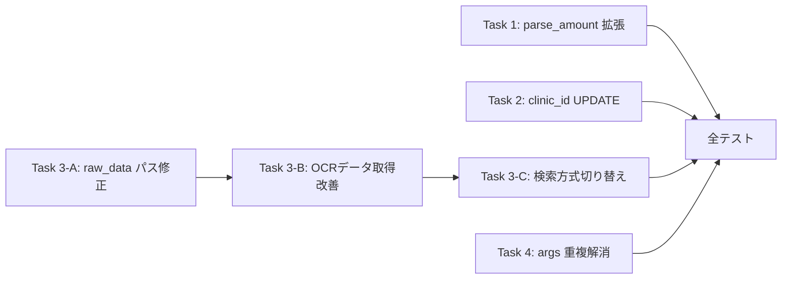

# Issue #26: 実装タスク一覧

## 優先順位・依存関係



**実装順序（推奨）**: Task 1 → Task 2 → Task 3-A → Task 3-B → Task 3-C → Task 4 → 全テスト

---

## Task 1: normalization.py — parse_amount のプレーン数字対応

**優先度: 中** — Issue 1 の修正

### 変更内容

`app/normalization.py::parse_amount()` の末尾（各正規表現マッチ後、`return None` の前）にプレーン数字文字列のパース処理を追加する。

```python
# プレーン数字文字列のパース（既存の円/万/漢数字パターンにマッチしなかった場合の最終手段）
# 例: "3800" → 3800, "3,800" → 3800
s_clean = t.replace(",", "").strip()
if s_clean.isdigit():
    try:
        return int(s_clean)
    except Exception:
        return None
```

### 注意点

- カンマ除去して `isdigit()` で判定 → フロートや記号混じりは弾く
- 既存の正規表現（円/万/漢数字）より**後**に配置する（既存の日本語形式を優先）
- 既存の正常系テスト（"3,800円" → 3800 等）に影響を与えないこと

**変更ファイル**: `app/normalization.py`

---

## Task 2: receipt_service.py — clinic_id UPDATE 追加

**優先度: 高** — Issue 2 の修正

### 変更内容

`app/services/receipt_service.py::update_receipt()` 内、`get_or_create_clinic()` 呼び出し後に `UPDATE receipts SET clinic_id = ? WHERE id = ?` を追加する。

既存コード（`receipt_service.py` 該当箇所）:
```python
if clinic_id_for_feedback is None and current_clinic:
    clinic_id_for_feedback = get_or_create_clinic(self.db_path, str(current_clinic))
```

この直後に追加:
```python
# clinic_id を receipt に書き戻す（既存レコードの外部キー更新）
if clinic_id_for_feedback:
    conn = get_db_connection(self.db_path)
    try:
        with conn:
            conn.execute(
                "UPDATE receipts SET clinic_id = ? WHERE id = ?",
                (clinic_id_for_feedback, receipt_id_for_feedback),
            )
    finally:
        conn.close()
```

### 注意点

- `add_correction()` は内部で独自の `conn` を開くため、必ずその**後**に実行する
- `receipt_id_for_feedback` が正しく設定されていること（`get_receipt` で既存 or `file_stem` で新規）

**変更ファイル**: `app/services/receipt_service.py`

---

## Task 3-A: receipt_service.py — raw_data パス解決修正

**優先度: 高** — Issue 3 の一部

### 変更内容

`update_receipt()` 内の `raw_data_json_path` を正しいファイル名で解決する。

**現状**（誤り）:
```python
raw_data_json_path = self.output_dir / f"{file_stem}.json"
```

**修正後**:
```python
# raw_data ファイルは {file_stem}_{mtime}-raw_data.json 形式
# mtime サフィックスが不確定なため glob で検索する
import glob
raw_data_pattern = str(self.output_dir / f"{file_stem}*-raw_data.json")
raw_data_matches = sorted(glob.glob(raw_data_pattern))
raw_data_json_path = Path(raw_data_matches[-1]) if raw_data_matches else None
```

### フォールバック
- `raw_data_json_path` が None（glob 不発）の場合: 座標フィードバック処理全体をスキップし、`append_error()` で記録

**変更ファイル**: `app/services/receipt_service.py`

---

## Task 3-B: receipt_service.py — OCR データ取得改善

**優先度: 高** — Issue 3 の一部

### 変更内容

`update_receipt()` 内で OCR エントリが取得できない場合のフォールバックとして、raw_data JSON ファイルから直接 OCR エントリを読み込む処理を追加する。

**現状**:
```python
receipt_with_ocr = get_receipt_by_source_path(self.db_path, str(raw_data_json_path))
if receipt_with_ocr is None:
    receipt_with_ocr = get_receipt(self.db_path, receipt_id_for_feedback)
```

**修正後**（raw_data_json_path が None ではない場合のフォールバック追加）:
```python
ocr_entries = None

# 方法1: DB から OCR データ取得
receipt_with_ocr = get_receipt_by_source_path(self.db_path, str(raw_data_json_path))
if receipt_with_ocr is None:
    receipt_with_ocr = get_receipt(self.db_path, receipt_id_for_feedback)

if receipt_with_ocr:
    ocr_json = receipt_with_ocr.get("ocr_json")
    ocr_entries = _extract_ocr_entries(ocr_json)

# 方法2: raw_data JSON ファイルから直接読み込み（フォールバック）
if ocr_entries is None and raw_data_json_path and raw_data_json_path.exists():
    try:
        raw_data = read_json(raw_data_json_path)
        ocr_entries = _extract_ocr_entries(raw_data)
    except Exception as e:
        append_error(self.output_dir, str(file_path), str(e), "fallback_raw_data_read", {})
```

そして `_extract_ocr_entries()` ヘルパー関数を追加:
```python
def _extract_ocr_entries(ocr_json: Any) -> Optional[List[Dict[str, Any]]]:
    """OCR JSON から OCR エントリリストを抽出する。"""
    if isinstance(ocr_json, list):
        return ocr_json
    if isinstance(ocr_json, dict):
        if "words" in ocr_json:
            return ocr_json["words"]
        if "text_lines" in ocr_json:
            return [{"text": t} for t in ocr_json["text_lines"]]
    return None
```

**変更ファイル**: `app/services/receipt_service.py`

---

## Task 3-C: receipt_service.py — 検索方式の切り替え（近接検索 + 文字列類似度）

**優先度: 高** — Issue 3 の核心

### 変更内容

`update_receipt()` 内で、検索方式を状況に応じて切り替える。テンプレート座標が存在する場合は `search_by_proximity_multi` を使用し、存在しない場合は従来の `search_coordinates` を使用する。

**変更イメージ**:
```python
from app.coord_search import search_coordinates, search_by_proximity_multi
from app.db import get_latest_template_by_clinic

# --- テンプレート座標の確認 ---
template_coords = None
if clinic_id_for_feedback:
    template = get_latest_template_by_clinic(self.db_path, clinic_id_for_feedback)
    if template:
        template_coords = template.get("coords_corrections")

coord_results = {}

if template_coords and ocr_entries:
    # 方式A: テンプレート座標 → 近接検索（search_by_proximity_multi）
    # OCR エントリの box 座標とテンプレート座標の中心点間距離（20px以内）でマッチ
    proximity_results = search_by_proximity_multi(ocr_entries, template_coords)
    for field_name, match in proximity_results.items():
        if match and match.get("box"):
            coord_results[field_name] = match["box"]
        else:
            coord_results[field_name] = None
else:
    # 方式B: テンプレート座標なし → 文字列類似度検索（search_coordinates）
    for field_name, query in field_queries.items():
        coord_results[field_name] = search_coordinates(ocr_entries, query) if ocr_entries else None
```

### 注意点

- `search_by_proximity_multi` の戻り値は `Dict[str, Optional[Dict]]`（OCR entry dict or None）
- `search_coordinates` の戻り値は `Optional[List[List[int]]]`（box 座標 or None）
- `process_correction_feedback()` に渡す `field_coords_map` は `Dict[str, Optional[List[List[int]]]]` である必要がある
- → `search_by_proximity_multi` の結果から `.get("box")` で座標のみ抽出して渡す

**変更ファイル**: `app/services/receipt_service.py`
**新規インポート**: `app.db.get_latest_template_by_clinic`, `app.coord_search.search_by_proximity_multi`

---

## Task 4: watcher.py — 引数定義重複解消 + model/db_path 伝播

**優先度: 低** — Issue 4 の修正

### 変更内容

1. `app/watcher.py::parse_args()` を削除（独立した引数定義は不要）
2. `watcher.py::__main__` ブロックで `app.args.setup_args()` を使用するように変更
3. `__main__` ブロックの `run_loop` / `run_watchdog` 呼び出しに `model=args.model` / `db_path=args.db_path` を追加

**変更前（__main__）**:
```python
if __name__ == "__main__":
    logging.basicConfig(...)
    args = parse_args()
    ...
    if args.use_watchdog:
        run_watchdog(..., retries=args.retries)  # model/db_path なし
    else:
        run_loop(..., retries=args.retries)       # model/db_path なし
```

**変更後**:
```python
if __name__ == "__main__":
    logging.basicConfig(...)
    from app.args import setup_args, setup_directories
    args = setup_args()  # args.py の一元管理を使用
    input_dir, output_dir, processed_dir, failed_dir = setup_directories(args)
    ...
    if args.use_watchdog:
        run_watchdog(..., retries=args.retries, model=args.model, db_path=args.db_path)
    else:
        run_loop(..., retries=args.retries, model=args.model, db_path=args.db_path)
```

### `parse_args()` 関数の扱い

- テストコードから `watcher.parse_args([...])` を呼び出している箇所がある場合、互換性のために残す
- ただし内部実装は `app.args.setup_args` に委譲する（delegate pattern）

**変更ファイル**: `app/watcher.py`

---

## ファイル変更サマリ

| ファイル | Task | 変更種別 | 変更規模 |
|---------|------|---------|---------|
| `app/normalization.py` | 1 | 修正（追加） | ~5行 |
| `app/services/receipt_service.py` | 2, 3-A, 3-B, 3-C | 修正（追加/変更） | ~40行 |
| `app/watcher.py` | 4 | 修正（削除/変更） | ~15行 |
| `tests/test_normalization.py` | 1 | 追加 | 既存ファイルに追加 |
| `tests/test_web.py` | 2, 3 | 追加 | 既存ファイルにテスト追加 |