# Issue #32: アーキテクチャ設計

## 全体データフロー

```mermaid
graph TD
    subgraph "OCR パイプライン（watcher / processor）"
        OCR["process_image()<br/>PaddleOCR"] --> RAW["raw_data.json<br/>(絶対座標)"]
        RAW --> NORM["normalize_coordinates() ★新規"]
        NORM -->|confidence >= 0.8| OVERWRITE["raw_data.json 上書き<br/>(相対座標)"]
        NORM -->|confidence < 0.8| SKIP["相対化スキップ<br/>low_confidence=True"]
        OVERWRITE --> EXTRACT["process_input_json()<br/>構造化抽出"]
        SKIP --> EXTRACT
        EXTRACT --> FLAG["low_confidence なら<br/>structured_data にフラグ追記"]
    end

    subgraph "Web UI 一覧表示"
        LIST["GET /<br/>get_all_receipts()"] --> CHECK["structured_data の<br/>low_confidence 確認"]
        CHECK -->|true| WARN["⚠ 読み取り不十分<br/>リンク右に表示"]
        CHECK -->|false| NORMAL["通常表示"]
    end

    subgraph "Web UI 修正フロー"
        PUT["PUT /{file_stem}<br/>update_receipt()"] --> LOAD["structured_data 読込"]
        LOAD --> GATE{"low_confidence?"}
        GATE -->|true| DB_ONLY["DB更新のみ<br/>(corrections反映)"]
        GATE -->|false| FULL["DB更新 +<br/>座標フィードバック<br/>(templates更新)"]
        DB_ONLY --> SAVE["JSON保存"]
        FULL --> SAVE
    end
```



## モジュール構成

### 新規モジュール

| モジュール | 責務 |
|-----------|------|
| `app/coord_normalizer.py` | 座標相対化 + confidence チェック |

### 変更モジュール

| モジュール | 変更内容 |
|-----------|---------|
| `app/watcher.py` | `process_one()` に `normalize_coordinates()` 呼び出し追加 + low_confidence フラグ反映 |
| `app/processor.py` | `process_single_image()` に同処理追加 |
| `app/structural_parser.py` | `DEFAULT_PROXIMITY_THRESHOLD` 20 → 50 |
| `app/services/receipt_service.py` | `get_all_receipts()` 戻り値に `low_confidence` 追加 |
| `app/services/receipt_updater.py` | `update_receipt()` で low_confidence 時は座標フィードバックスキップ |
| `app/web/templates/index.html` | 各リンク右に警告表示 |

### 変更しないモジュール

| モジュール | 理由 |
|-----------|------|
| `app/ocr_pipeline.py` | OCR 処理自体は不変。座標相対化は後処理として分離 |
| `app/coord_search.py` | 検索ロジックは不変（しきい値は呼び出し側で指定） |
| `app/db.py` | DB 操作は不変 |
| `app/template_feedback.py` | テンプレート更新ロジックは不変（呼び出し側でゲーティング） |
| `app/web/server.py` | Web UI ルーティングは不変 |
| `main.py` | エントリポイントは不変 |

## 座標相対化の詳細設計

### `normalize_coordinates(raw_data_path: Path) -> Dict[str, Any]`

**入力**: raw_data.json のパス（OCR エントリリスト: `[{text, confidence, box}]`）

**処理**:
1. 全 OCR エントリの box 座標から最小 x と最小 y を算出
   - `min_x = min(all box points x)`
   - `min_y = min(all box points y)`
2. 最小 y を持つエントリの confidence を確認
3. confidence >= 0.8 の場合:
   - 全エントリの box 座標から `(min_x, min_y)` を減算
   - raw_data.json を上書き保存
4. confidence < 0.8 の場合:
   - ファイルを変更せず、`low_confidence=True` を返す

**戻り値**:
```python
{
    "normalized": bool,        # 相対化を実行したか
    "low_confidence": bool,    # 最上部要素の confidence < 0.8
    "topmost_confidence": float,  # 最上部要素の confidence 値
    "offset_x": int,           # 減算した x オフセット
    "offset_y": int,           # 減算した y オフセット
}
```

### パイプライン統合パターン

```python
# watcher.py / processor.py での統合
from app.coord_normalizer import normalize_coordinates

# Step 1: OCR
structured = process_image(image_path, output_dir=..., output_json_path=output_json_path, ocr=ocr)

# Step 2: 座標相対化
norm_result = normalize_coordinates(output_json_path)

# Step 3: 構造化抽出
structured_data = process_input_json(output_json_path, model=model, output_dir=output_dir, db_path=db_path)

# Step 4: low_confidence フラグ反映
if norm_result.get("low_confidence") and structured_data:
    structured_data["low_confidence"] = True
    structured_data_path = output_dir / f"{output_json_path.stem.replace('-raw_data', '')}-structured_data.json"
    if structured_data_path.exists():
        from app.output import write_json_atomic
        write_json_atomic(structured_data_path, structured_data)
```

## エラーハンドリング

| シナリオ | 対応 |
|---------|------|
| raw_data.json が存在しない | `normalize_coordinates()` 内で `FileNotFoundError` → 呼び出し元でキャッチしログ記録、処理継続 |
| box 座標が不正（空リスト等） | 該当エントリをスキップ。全エントリが不正なら `normalized=False` を返す |
| confidence が None | `confidence < 0.8` と同様に扱う（安全側） |
| 単一要素のみの raw_data | 正常に相対化（min_x=min_y=0 になる） |
| low_confidence フラグ追記時のファイル書込失敗 | `write_json_atomic` の例外をキャッチしログ記録、処理継続 |