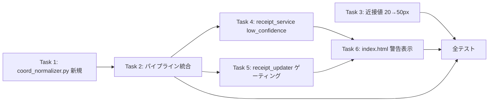

# Issue #32: 実装タスク一覧

## 優先順位・依存関係



**実装順序（推奨）**: Task 1 → Task 2 → Task 3 → Task 4 → Task 5 → Task 6 → Task 7（テスト）→ 全テスト実行

---

## Task 1: coord_normalizer.py 新規作成

**優先度: 高** — 座標相対化の核

### 変更内容

`app/coord_normalizer.py` を新規作成し、`normalize_coordinates()` 関数を実装する。

```python
"""Coordinate normalizer: convert absolute OCR coordinates to relative positions."""

from __future__ import annotations

from pathlib import Path
from typing import Any, Dict, List, Optional


def _find_min_coords(ocr_entries: List[Dict[str, Any]]) -> tuple[Optional[int], Optional[int], Optional[float]]:
    """Find the minimum x, minimum y across all boxes, and the confidence of the topmost element.
    
    Args:
        ocr_entries: List of OCR result dicts with keys 'text', 'confidence', 'box'.
        
    Returns:
        Tuple of (min_x, min_y, topmost_confidence).
        min_x/min_y are None if no valid boxes found.
        topmost_confidence is None if no valid entry found.
    """
    min_x = None
    min_y = None
    topmost_confidence = None
    topmost_y = None
    
    for entry in ocr_entries:
        box = entry.get("box")
        if not box or not isinstance(box, list) or len(box) < 4:
            continue
        
        # Find this box's min x and min y
        for point in box:
            if not isinstance(point, (list, tuple)) or len(point) < 2:
                continue
            x, y = point[0], point[1]
            
            if min_x is None or x < min_x:
                min_x = x
            if min_y is None or y < min_y:
                min_y = y
        
        # Track topmost element's confidence
        box_min_y = min(p[1] for p in box if isinstance(p, (list, tuple)) and len(p) >= 2)
        if topmost_y is None or box_min_y < topmost_y:
            topmost_y = box_min_y
            topmost_confidence = entry.get("confidence")
    
    return min_x, min_y, topmost_confidence


def _subtract_offset(box: List[List[int]], offset_x: int, offset_y: int) -> List[List[int]]:
    """Subtract offset from all points in a box."""
    return [[p[0] - offset_x, p[1] - offset_y] for p in box]


def normalize_coordinates(raw_data_path: Path) -> Dict[str, Any]:
    """Normalize OCR coordinates to relative positions.
    
    Finds the topmost element (min y) and leftmost element (min x),
    then subtracts these offsets from all box coordinates.
    
    If the topmost element's confidence < 0.8, normalization is skipped.
    
    Args:
        raw_data_path: Path to the raw_data.json file.
        
    Returns:
        Dict with keys:
            - normalized: bool
            - low_confidence: bool
            - topmost_confidence: float or None
            - offset_x: int
            - offset_y: int
    """
    import json
    
    if not raw_data_path.exists():
        raise FileNotFoundError(f"raw_data not found: {raw_data_path}")
    
    with open(raw_data_path, encoding="utf-8") as f:
        ocr_entries = json.load(f)
    
    if not isinstance(ocr_entries, list) or not ocr_entries:
        return {
            "normalized": False,
            "low_confidence": False,
            "topmost_confidence": None,
            "offset_x": 0,
            "offset_y": 0,
        }
    
    min_x, min_y, topmost_confidence = _find_min_coords(ocr_entries)
    
    if min_x is None or min_y is None:
        return {
            "normalized": False,
            "low_confidence": False,
            "topmost_confidence": topmost_confidence,
            "offset_x": 0,
            "offset_y": 0,
        }
    
    # Check confidence
    low_confidence = topmost_confidence is None or topmost_confidence < 0.8
    
    if low_confidence:
        return {
            "normalized": False,
            "low_confidence": True,
            "topmost_confidence": topmost_confidence,
            "offset_x": 0,
            "offset_y": 0,
        }
    
    # Normalize coordinates
    normalized_entries = []
    for entry in ocr_entries:
        box = entry.get("box")
        if box and isinstance(box, list):
            entry["box"] = _subtract_offset(box, min_x, min_y)
        normalized_entries.append(entry)
    
    # Write back
    from app.output import write_json_atomic
    write_json_atomic(raw_data_path, normalized_entries)
    
    return {
        "normalized": True,
        "low_confidence": False,
        "topmost_confidence": topmost_confidence,
        "offset_x": min_x,
        "offset_y": min_y,
    }
```

### 注意点
- `_find_min_coords()` は box の全4点から最小 x/y を探索（box[0] だけ見ると傾きに対応できない）
- confidence が None の場合は安全側に倒して low_confidence 扱い
- `write_json_atomic` でアトミック書き込み（既存の出力ユーティリティを再利用）

**新規ファイル**: `app/coord_normalizer.py`

---

## Task 2: パイプライン統合（watcher.py / processor.py）

**優先度: 高** — 座標相対化を実際の処理フローに組み込む

### 変更内容

#### watcher.py::process_one()

`process_image()` の直後、`process_input_json()` の直前に `normalize_coordinates()` を追加。
`process_input_json()` の後に low_confidence フラグを structured_data に反映。

```python
# process_one() 内、process_image() 後
from app.coord_normalizer import normalize_coordinates

# Step 2: 座標相対化
try:
    norm_result = normalize_coordinates(output_json_path)
    low_confidence = norm_result.get("low_confidence", False)
except Exception:
    LOG.exception("Coordinate normalization failed for %s", output_json_path)
    low_confidence = False

# Step 3: 構造化抽出（既存）
try:
    structured_data = process_input_json(...)
except Exception:
    ...

# Step 4: low_confidence フラグ反映
if low_confidence:
    structured_data_path = output_dir / f"{image_path.stem}_{mtime}-structured_data.json"
    if structured_data_path.exists():
        try:
            from app.output import read_json, write_json_atomic
            sd = read_json(structured_data_path)
            sd["low_confidence"] = True
            write_json_atomic(structured_data_path, sd)
        except Exception:
            LOG.exception("Failed to set low_confidence flag for %s", structured_data_path)
```

#### processor.py::process_single_image()

同様の変更を `process_single_image()` に追加。

### 注意点
- `normalize_coordinates()` の失敗は OCR 処理の成功を無効にしない — エラーはログに記録し処理継続
- structured_data のファイル名は `{stem}_{mtime}-structured_data.json` 形式

**変更ファイル**: `app/watcher.py`, `app/processor.py`

---

## Task 3: 近接値しきい値 20px → 50px

**優先度: 中** — サンプル分析に基づく調整

### 変更内容

`app/structural_parser.py` の `DEFAULT_PROXIMITY_THRESHOLD` を 20.0 から 50.0 に変更。

```python
# Before
DEFAULT_PROXIMITY_THRESHOLD: float = 20.0

# After
DEFAULT_PROXIMITY_THRESHOLD: float = 50.0
```

### 注意点
- `coord_search.py` の `search_by_proximity()` / `search_by_proximity_multi()` のデフォルトしきい値（20.0）は変更しない
  - これらの関数は呼び出し側から明示的に threshold を指定されることを想定
  - `structural_parser.py` からの呼び出しのみ 50px になる
- テストコード内でハードコードされた 20.0 がある場合、50.0 に更新する

**変更ファイル**: `app/structural_parser.py`

---

## Task 4: receipt_service.py — low_confidence 情報追加

**優先度: 中** — 一覧表示のためのデータ準備

### 変更内容

`ReceiptService.get_all_receipts()` の戻り値に `low_confidence` フィールドを追加。

```python
def get_all_receipts(self) -> List[Dict[str, Any]]:
    items = []
    for file_path in self.file_repo.find_all_receipt_files():
        try:
            data = self.file_repo.load_receipt(file_path.stem.replace("-structured_data", ""))
            file_stem = file_path.stem.replace("-structured_data", "")
            clinic = data.get("clinic")
            date = data.get("date")
            if clinic and date:
                display_name = f"{clinic}-{date}"
            else:
                display_name = file_stem
            items.append({
                "file_stem": file_stem,
                "display_name": display_name,
                "clinic": clinic,
                "date": date,
                "low_confidence": data.get("low_confidence", False),  # ← 追加
            })
        except Exception as e:
            ...
    return items
```

**変更ファイル**: `app/services/receipt_service.py`

---

## Task 5: receipt_updater.py — テンプレート更新ゲーティング

**優先度: 高** — 受入条件の核心

### 変更内容

`ReceiptUpdater.update_receipt()` で、読み込んだ structured_data に `low_confidence: true` がある場合、座標フィードバック（テンプレート更新）をスキップする。

```python
def update_receipt(self, file_stem: str, updates: Dict[str, Any]) -> Dict[str, Any]:
    file_path = self.file_repo.output_dir / f"{file_stem}-structured_data.json"

    # Step 1: Load existing data
    old_data = self.file_repo.load_receipt(file_stem)
    
    # Check low_confidence flag
    low_confidence = old_data.get("low_confidence", False)

    # Step 2: Apply updates and normalize
    updated_data = self.normalizer.normalize(updates, old_data)

    # Step 3: Database updates
    feedback_info = {"receipt_id": None, "clinic_id": None}
    if self.db_repo.is_available():
        try:
            feedback_info = self.db_repo.apply_receipt_updates(...)
        except Exception as e:
            append_error(...)

    # Step 4: Coordinate feedback (skip if low confidence)
    feedback_result = None
    if not low_confidence:
        feedback_result = self.coord_service.process_feedback(
            file_stem=file_stem,
            file_path=file_path,
            old_data=old_data,
            updates=updates,
            receipt_id=feedback_info.get("receipt_id"),
            clinic_id=feedback_info.get("clinic_id"),
        )

    # Step 5: Save updated data to file
    self.file_repo.save_receipt(file_stem, updated_data)

    # Build result
    coord_errors = []
    if feedback_result and feedback_result.get("not_found_fields"):
        coord_errors = feedback_result["not_found_fields"]

    return {
        "status": "updated",
        "data": updated_data,
        "coord_errors": coord_errors,
        "feedback_result": feedback_result,
    }
```

### 注意点
- low_confidence 時も DB 更新（corrections, clinic_id）は通常通り実行される
- 座標フィードバックをスキップしても JSON ファイルの更新は行われる
- `coord_errors` は空リストになる（座標検索自体を行わないため）

**変更ファイル**: `app/services/receipt_updater.py`

---

## Task 6: index.html — 警告表示

**優先度: 中** — UI 表示

### 変更内容

一覧ページの各リンク右に、low_confidence なレシートに警告を表示する。

```html

<tr>
    <td>
        <a href="{{ item.file_stem }}">{{ item.display_name }}</a>
        
        <span style="color: #dc3545; font-size: 12px; margin-left: 8px;">⚠ 読み取り不十分</span>
        
    </td>
</tr>

```

**変更ファイル**: `app/web/templates/index.html`

---

## ファイル変更サマリ

| ファイル | Task | 変更種別 | 変更規模 |
|---------|------|---------|---------|
| `app/coord_normalizer.py` | 1 | **新規** | ~80行 |
| `app/watcher.py` | 2 | 修正（追加） | ~15行 |
| `app/processor.py` | 2 | 修正（追加） | ~15行 |
| `app/structural_parser.py` | 3 | 修正（定数変更） | 1行 |
| `app/services/receipt_service.py` | 4 | 修正（追加） | 1行 |
| `app/services/receipt_updater.py` | 5 | 修正（追加） | ~10行 |
| `app/web/templates/index.html` | 6 | 修正（追加） | ~5行 |
| `tests/test_coord_normalizer.py` | 7 | **新規** | ~100行 |
| `tests/test_web.py` | 7 | 修正（追加） | ~30行 |