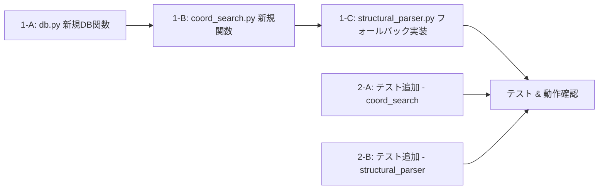

# Issue #34: 実装タスク一覧

## 優先順位・依存関係



---

## Task 1-A: db.py に新規DB関数を追加

**優先度: 高** — フォールバックマッチングのデータ取得基盤

### 変更内容

`app/db.py` に以下の2関数を追加:

#### `get_all_clinics(db_path: str | Path) -> List[Dict[str, Any]]`

全クリニックの一覧を取得する（読み取り専用、作成しない）。

```python
def get_all_clinics(db_path: str | Path) -> List[Dict[str, Any]]:
    conn = get_db_connection(db_path)
    try:
        cursor = conn.execute("SELECT id, name, created_at FROM clinics ORDER BY name")
        return [dict(row) for row in cursor.fetchall()]
    finally:
        conn.close()
```

#### `get_all_templates_with_names(db_path: str | Path) -> List[Dict[str, Any]]`

全テンプレートをクリニック名付きで取得する。各クリニックの最新バージョンのみを取得する。

```python
def get_all_templates_with_names(db_path: str | Path) -> List[Dict[str, Any]]:
    conn = get_db_connection(db_path)
    try:
        cursor = conn.execute("""
            SELECT t.id, t.clinic_id, t.version, t.coords_corrections,
                   t.created_at, c.name as clinic_name
            FROM templates t
            JOIN clinics c ON t.clinic_id = c.id
            WHERE t.version = (
                SELECT MAX(t2.version) FROM templates t2 WHERE t2.clinic_id = t.clinic_id
            )
        """)
        results = []
        for row in cursor.fetchall():
            result = dict(row)
            if result["coords_corrections"]:
                result["coords_corrections"] = json.loads(result["coords_corrections"])
            results.append(result)
        return results
    finally:
        conn.close()
```

### 注意点
- 両関数とも `get_db_connection` → `try/finally` → `conn.close()` のパターンに従う
- `get_all_clinics` は `ORDER BY name` で安定した順序を保証
- `get_all_templates_with_names` はサブクエリで各クリニックの最新バージョンのみを取得

**変更ファイル**: `app/db.py`
**テスト**: `tests/test_db.py` に追加（既存の `temp_db` フィクスチャを流用）

---

## Task 1-B: coord_search.py にマッチング関数を追加

**優先度: 高** — フォールバックマッチングのコアロジック

### 追加関数

#### `find_clinic_by_text_similarity(clinic_name: str, clinics: List[Dict[str, Any]], threshold: float = 0.6) -> Optional[Dict[str, Any]]`

抽出されたクリニック名と最も類似する既存クリニックを検索する。

```python
def find_clinic_by_text_similarity(
    clinic_name: str,
    clinics: List[Dict[str, Any]],
    threshold: float = 0.6,
) -> Optional[Dict[str, Any]]:
    if not clinic_name or not clinics:
        return None

    norm_query = normalize_text(clinic_name)
    if not norm_query:
        return None

    best_ratio = 0.0
    best_clinic = None

    for clinic in clinics:
        clinic_name_str = clinic.get("name", "")
        if not clinic_name_str:
            continue
        norm_name = normalize_text(clinic_name_str)
        if not norm_name:
            continue
        ratio = difflib.SequenceMatcher(None, norm_query, norm_name).ratio()
        if ratio > best_ratio:
            best_ratio = ratio
            best_clinic = clinic

    if best_ratio >= threshold and best_clinic is not None:
        return best_clinic

    return None
```

#### `match_template_by_layout(ocr_entries: List[Dict[str, Any]], templates: List[Dict[str, Any]], proximity_threshold: float = 50.0, match_ratio: float = 0.6) -> Optional[Dict[str, Any]]`

OCRエントリの座標パターンと最も一致するテンプレートを検索する。

```python
def match_template_by_layout(
    ocr_entries: List[Dict[str, Any]],
    templates: List[Dict[str, Any]],
    proximity_threshold: float = 50.0,
    match_ratio: float = 0.6,
) -> Optional[Dict[str, Any]]:
    if not ocr_entries or not templates:
        return None

    best_template = None
    best_rate = 0.0

    for template in templates:
        coords = template.get("coords_corrections")
        if not coords:
            continue

        fields = list(coords.keys())
        if not fields:
            continue

        matched_count = 0
        for field_name in fields:
            field_box = coords[field_name]
            if field_box is None:
                continue
            match = search_by_proximity(ocr_entries, field_box, proximity_threshold)
            if match:
                matched_count += 1

        rate = matched_count / len(fields)
        if rate > best_rate:
            best_rate = rate
            best_template = template

    if best_rate >= match_ratio and best_template is not None:
        return best_template

    return None
```

### テストケース（`test_coord_search.py` に追加）

| テスト | 概要 |
|--------|------|
| `test_find_clinic_by_text_similarity_exact` | 完全一致でマッチ |
| `test_find_clinic_by_text_similarity_partial` | 文字欠け（"BC" → "ABC"）でマッチ |
| `test_find_clinic_by_text_similarity_no_match` | 類似度不足で None |
| `test_find_clinic_by_text_similarity_empty` | 空入力で None |
| `test_match_template_by_layout_exact` | 全フィールド一致でマッチ |
| `test_match_template_by_layout_partial` | 一部フィールドのみマッチ（閾値以上） |
| `test_match_template_by_layout_no_match` | マッチ率不足で None |
| `test_match_template_by_layout_empty` | 空エントリで None |

**変更ファイル**: `app/coord_search.py`, `tests/test_coord_search.py`

---

## Task 1-C: structural_parser.py にハイブリッドフォールバック実装

**優先度: 高** — 本Issueのメイン変更

### 変更内容

`_apply_template_corrections()` を以下のように修正する:

#### 1. `_get_ocr_entries()` ヘルパーを抽出

現在 `_apply_template_corrections` 内でインラインで行われているOCRエントリ抽出をヘルパー関数に切り出す:

```python
@staticmethod
def _get_ocr_entries(ocr_json: Dict[str, Any]) -> List[Dict[str, Any]]:
    """Extract OCR entries from various OCR JSON formats."""
    ocr_entries: List[Dict[str, Any]] = []
    if isinstance(ocr_json, list):
        ocr_entries = ocr_json
    elif isinstance(ocr_json, dict):
        words = ocr_json.get("words", [])
        if words:
            ocr_entries = words
    return ocr_entries
```

#### 2. `_apply_template_corrections()` にフォールバックロジックを追加

```python
def _apply_template_corrections(self, ocr_json, extracted):
    if self.db_path is None:
        return extracted

    try:
        clinic_name = str(extracted.get("clinic", "")).strip()
        if not clinic_name:
            return extracted

        # Step 1: 完全一致（読み取り専用、作成しない）
        clinic = get_clinic_by_name(self.db_path, clinic_name)
        template = None
        matched_clinic_name = None

        if clinic:
            template = get_latest_template_by_clinic(self.db_path, clinic["id"])
            matched_clinic_name = clinic_name

        # Step 2: テキスト類似度マッチング
        if not template:
            clinics = get_all_clinics(self.db_path)
            match = find_clinic_by_text_similarity(clinic_name, clinics)
            if match:
                clinic = match
                template = get_latest_template_by_clinic(self.db_path, clinic["id"])
                matched_clinic_name = clinic["name"]
                logger.info(
                    f"Template matched by text similarity: "
                    f"'{clinic_name}' → '{matched_clinic_name}'"
                )

        # Step 3: 座標レイアウトマッチング
        if not template:
            ocr_entries = self._get_ocr_entries(ocr_json)
            if ocr_entries:
                all_templates = get_all_templates_with_names(self.db_path)
                matched = match_template_by_layout(
                    ocr_entries,
                    all_templates,
                    proximity_threshold=DEFAULT_PROXIMITY_THRESHOLD,
                )
                if matched:
                    template = matched
                    matched_clinic_name = matched["clinic_name"]
                    logger.info(
                        f"Template matched by layout: "
                        f"'{clinic_name}' → '{matched_clinic_name}'"
                    )

        # テンプレート適用
        if template and matched_clinic_name:
            coords = template.get("coords_corrections")
            if coords:
                ocr_entries = self._get_ocr_entries(ocr_json)
                if ocr_entries:
                    proximity_texts = search_fields_by_proximity(
                        ocr_entries, coords, threshold=DEFAULT_PROXIMITY_THRESHOLD,
                    )
                    for field_name, concat_text in proximity_texts.items():
                        if concat_text and field_name in extracted:
                            extracted[field_name] = concat_text

            # 正しいクリニック名で上書き
            if matched_clinic_name != clinic_name:
                extracted["clinic"] = matched_clinic_name
        else:
            # いずれもマッチなし → 新規クリニック作成（従来動作）
            get_or_create_clinic(self.db_path, clinic_name)

    except Exception as e:
        logger.error(f"Template proximity correction failed: {e}")

    return extracted
```

### 注意点

- `get_clinic_by_name()` は読み取り専用（作成しない） — フォールバック時は新規クリニック作成を防ぐ
- Step2/3 でマッチした場合、`extracted["clinic"]` を正しい名前に上書き → 後続の `get_or_create_clinic()` が正しい既存クリニックを参照する
- 全ステップマッチなし → `get_or_create_clinic()` で従来通り新規作成
- 各Stepは独立した `try/except` ブロック内で動作し、失敗しても次のStepへフォールバックする
- マッチ成功時は `logger.info()` でどの方法でマッチしたかを記録

**変更ファイル**: `app/structural_parser.py`
**テスト**: `tests/test_structural_parser.py` に追加

---

## 実装順序（推奨）

```
1-A: db.py 新規DB関数追加
  ↓
1-B: coord_search.py 新規関数追加 + 単体テスト
  ↓
1-C: structural_parser.py フォールバック実装 + 結合テスト
  ↓
全テスト実行 + 動作確認
  ↓
black .
```