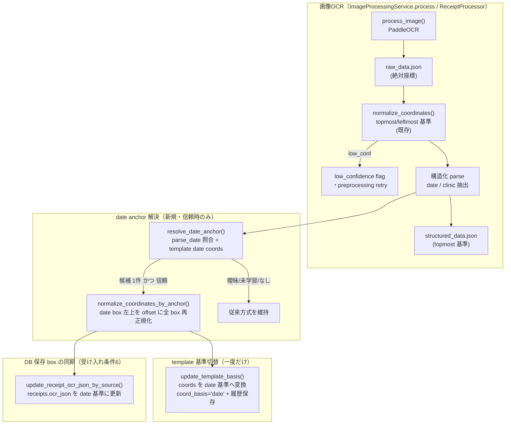
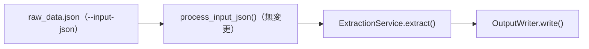

# Issue #39: アーキテクチャ設計

## 全体データフロー

### 画像 OCR 経路（従来 + date anchor）

### 既存 OCR JSON 経路（process_input_json）

`process_input_json` は**無変更**（後方互換維持）。date anchor 解決は画像OCR / watcher 経路にのみ統合される。

## モジュール構成

### 新規モジュール

| モジュール | 責務 |
|-----------|------|
| `app/date_anchor.py` | 構造化 date と OCR date box の照合・anchor box 解決 |

### 変更モジュール

| モジュール | 変更内容 |
|-----------|---------|
| `app/coord_normalizer.py` | `normalize_coordinates_by_anchor()`（box 基準再正規化）と `shift_template_coords()` を追加。従来 `normalize_coordinates()` は変更しない |
| `app/db.py` | `update_template_basis()`（同一トランザクションで履歴保存 + coord_basis 更新）と `update_receipt_ocr_json_by_source()` を追加。`get_latest_template_by_clinic()` が `coord_basis` を返す |
| `app/db_migrations.py` | idempotent な `coord_basis` 列追加 migration |
| `docs/schema.sql` | `templates.coord_basis` 列追加 |
| `app/services/image_processing_service.py` | `process()` に anchor 解決 → 再正規化 → DB ocr_json 更新を挿入。`_parse_structured()` が structured を返す |
| `app/services/receipt_processor.py` | `_sync_process()` に同じ anchor ロジックを挿入 |

### 変更しないモジュール

| モジュール | 理由 |
|-----------|------|
| `app/ocr_pipeline.py` | OCR 処理自体は不変（anchor は後処理） |
| `app/coord_search.py` | `search_by_proximity()` / `search_by_proximity_multi()` を再利用するのみ。しきい値は呼び出し側指定 |
| `app/normalization.py` | `parse_date()` を再利用するのみ |
| `app/template_feedback.py` | `process_correction_feedback()` は変更なし（topmost 基準で学習を続ける） |
| `app/services/ocr_coordinate_service.py` | 修正時の近傍検索は date 基準でそのまま動作（既存 coords が変換済み） |
| `app/services/receipt_updater.py` | low_confidence gate などの既存フローは不変 |
| `app/structural_parser.py` | `process_input_json` は無変更（後方互換） |
| `app/input.py` | `read_json()` を再利用するのみ |
| `main.py` | エントリポイントは不変 |

## date anchor 解決の詳細設計

### `resolve_date_anchor(ocr_entries, structured_date, template_date_box=None, proximity_threshold=50.0) -> Optional[List[List[int]]]`

**入力**: OCR エントリリスト、構造化 date（ISO または生文字列）、template date coords（topmost 基準、任意）、近接しきい値。

**処理**（Q1/Q2 の確定次第で分岐）:
1. `structured_date` を `parse_date()` で正規化。`None` なら `None` を返す（従来方式）。
2. `find_date_candidates()` で、`parse_date(text) == target` の OCR エントリを列挙。
3. 候補が 0 件なら `None`（テキスト照合失敗 → 従来方式）。
4. 候補が 1 件:
   - Q2 案 A: `template_date_box` がある場合のみその box を採用。なければ `None`。
   - Q2 案 B: 常に採用。
5. 候補が複数:
   - `template_date_box` があれば `search_by_proximity()` で中心距離が `proximity_threshold` 以内で**一意に**最も近いものを採用。重複・競合なら `None`（曖昧）。
   - `template_date_box` がなければ `None`。

**戻り値**: 信頼できる date anchor box、または `None`（従来方式へ）。

### `normalize_coordinates_by_anchor(raw_data_path, anchor_box) -> Dict[str, Any]`

anchor_box の左上（min_x, min_y）を offset として全 box に減算し、`raw_data.json` を上書き。戻り値は既存 `normalize_coordinates()` の規約（`normalized` / `low_confidence` / `offset_x` / `offset_y`）に準拠。

### template 基準切替

`update_template_basis(db_path, clinic_id, new_coords, ...)` が、
1. 最新 template の `coord_basis` を確認 → `'date'` なら何もしない（二重変換防止）。
2. 変換前の topmost coords を `template_history`（`change_reason='basis_migration'`）に INSERT。
3. 同一トランザクションで `coords_corrections` を date 基準へ UPDATE し `coord_basis='date'` に SET。

### 座標系の一貫性

| 保存先 | 基準 | 備考 |
|--------|------|------|
| `raw_data.json` | date 基準（anchor 確定時）| `normalize_coordinates_by_anchor()` で上書き |
| `receipts.ocr_json`（DB） | date 基準 | `update_receipt_ocr_json_by_source()` で更新 |
| `structured_data.json` | 座標基準に非依存（テキスト抽出値）| 再解析は行わない |
| `templates.coords_corrections` | date 基準（切替済み）| `coord_basis` で識別 |
| OCR 未学習 clinic | topmost 基準（従来）| anchor 解決しない |

## エラーハンドリング

| シナリオ | 対応 |
|---------|------|
| `parse_date()` が structured_date で None | anchor 解決せず従来方式へ |
| OCR に一致する日付候補なし | `find_date_candidates()` が空 → 従来方式 |
| 候補が複数で template date box なし | `resolve_date_anchor()` が `None` → 従来方式 |
| 複数候補が距離的に競合 | 一意にならない → `None` → 従来方式 |
| `template_date_box` が不正 | `search_by_proximity()` が `None` → 従来方式 |
| `update_template_basis()` の途中失敗 | トランザクションでロールバック（部分更新防止）|
| `coord_basis` 作成前の既存 DB | idempotent ALTER で列追加 |
| 二重変換（既に date 基準） | `coord_basis=='date'` でスキップ |
| low-confidence / preprocessing retry | anchor ロジックを低 Confidence 判定の後に実行し既存挙動を維持 |
