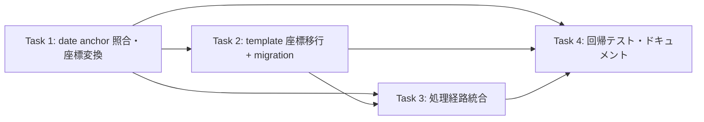

# Issue #39: 実装タスク一覧

## 優先順位・依存関係



**実装順序（推奨）**: Task 1 → Task 2 → Task 3 → Task 4（テスト・ドキュメント）→ 全テスト実行

※ 依存関係は issue 本体の mermaid と同じ。Task 4 は 1〜3 それぞれの成果物にテストを対応付ける。

---

## Task 1: date anchor 照合・座標変換

**優先度: 高** — 本機能の中核

### 変更内容

#### 1-a. 日付候補の列挙ヘルパ

`app/coord_normalizer.py`（または新規 `app/date_anchor.py`）に、OCR エントリから構造化 date と同値（`parse_date()` で ISO 化して比較）の候補 box を列挙する処理を追加。

```python
"""app/date_anchor.py — structured date と OCR date box の照合・anchoring."""

from __future__ import annotations

from typing import Any, Dict, List, Optional

from app.normalization import parse_date


def find_date_candidates(ocr_entries: List[Dict[str, Any]], structured_date: str) -> List[Dict[str, Any]]:
    """構造化 date と同じ日付値を持つ OCR エントリ（有効な box を持つもの）を列挙する。

    parse_date() で OCR テキストを ISO YYYY-MM-DD に正規化し、structured_date と比較する。
    比較前に structured_date も parse_date() で正規化しておく（None なら空リスト）。
    """
    if not structured_date:
        return []
    target = parse_date(structured_date)
    if target is None:
        return []
    candidates = []
    for entry in ocr_entries:
        text = entry.get("text")
        box = entry.get("box")
        if not text or not box:
            continue
        if parse_date(text) == target:
            candidates.append(entry)
    return candidates
```

#### 1-b. anchor box 解決

複数候補時に template date coords（既存 topmost 基準）の中心距離で一意に絞る。テキスト一致が 1 件ならその box を返す。曖昧・一致なし・未学習は `None` を返す。

```python
def resolve_date_anchor(
    ocr_entries: List[Dict[str, Any]],
    structured_date: str,
    template_date_box: Optional[List[List[int]]] = None,
    proximity_threshold: float = 50.0,
) -> Optional[List[List[int]]]:
    """信頼できる date anchor box を返す。無理なら None（従来方式）。

    - テキスト一致候補がなければ None。
    - 候補が 1 件ならその box を返す（Q2 が案 A なら template_date_box がある場合のみ採用）。
    - 複数候補で template_date_box がある場合、search_by_proximity() で中心距離が
      proximity_threshold 以内で一意に近いものだけを採用。
    """
    from app.coord_search import search_by_proximity
    # 実装詳細（Q1/Q2 の確定次第で分岐）
    ...
```

#### 1-c. date 基準での再正規化（API 追加）

`coord_normalizer.py` に、既存 `normalize_coordinates()`（グローバル min）とは別に、指定 box の左上を offset とする関数を追加。`_subtract_offset` と `write_json_atomic` を再利用。

```python
def normalize_coordinates_by_anchor(raw_data_path: Path, anchor_box: List[List[int]]) -> Dict[str, Any]:
    """anchor_box の左上 (min_x, min_y) を offset として全 box を再正規化する。

    anchor_box が不正（4点未満等）なら何もせず normalized=False を返す。
    正常時は normalized=True / offset_x / offset_y を返す。
    """
    ...
```

### 注意点
- `_subtract_offset` は box 内の不正点をスキップする既存実装をそのまま使う。
- グローバル min 基準の `normalize_coordinates()` は変更しない（後方互換）。
- 戻り値・ログ・エラー処理は既存 `normalize_coordinates()` の規約（`normalized` / `low_confidence` / `offset_x` / `offset_y`）に揃える。
- 低 Confidence 判定（0.8）と前処理 retry の挙動は変えない（受入条件 5）。

**変更ファイル**: `app/coord_normalizer.py`（+ 新規 `app/date_anchor.py`）

---

## Task 2: template 座標基準の移行と DB migration

**優先度: 高** — 受入条件 4 / 6 の核心

### 変更内容

#### 2-a. 座標基準の識別

`templates` に `coord_basis` 列を追加（Q3 が案 A の場合）。`docs/schema.sql` の `templates` 定義を更新。

```sql
-- docs/schema.sql 内 templates
CREATE TABLE IF NOT EXISTS templates (
    id TEXT PRIMARY KEY,
    clinic_id TEXT NOT NULL,
    version INTEGER NOT NULL,
    coords_corrections TEXT,
    coord_basis TEXT NOT NULL DEFAULT 'topmost',  -- ← 追加: 'topmost' | 'date'
    created_at TIMESTAMP DEFAULT CURRENT_TIMESTAMP,
    FOREIGN KEY (clinic_id) REFERENCES clinics(id) ON DELETE CASCADE
);
```

#### 2-b. idempotent migration

`app/db_migrations.py` に、既存 DB へ列を追加する migration を追加。`CREATE TABLE IF NOT EXISTS` は既存テーブルに列を追加しないため、`PRAGMA table_info(templates)` で存在確認してから `ALTER TABLE ... ADD COLUMN` を実行する。

```python
def _add_coord_basis_column_if_missing(conn) -> None:
    cols = {row["name"] for row in conn.execute("PRAGMA table_info(templates)")}
    if "coord_basis" not in cols:
        conn.execute(
            "ALTER TABLE templates ADD COLUMN coord_basis TEXT NOT NULL DEFAULT 'topmost'"
        )
```

`run_migrations()` の schema 適用後に上記を呼ぶ（コネクション再利用、トランザクション内）。

#### 2-c. topmost → date 基準への template 座標変換

date anchor 決定時に、`coords_corrections` の全 box から date offset（anchor box 左上）を減算して date 基準へ変換。変換は一度だけ実施（`coord_basis` が `'date'` なら skip）。

仮の変換ヘルパ（`app/coord_normalizer.py` または新規）：

```python
def shift_template_coords(coords: Dict[str, Any], offset_x: int, offset_y: int) -> Dict[str, Any]:
    """coords_corrections 内の全 box（単一/マルチ box 対応）から offset を減算する。"""
    ...
```

#### 2-d. 同一トランザクションで履歴保存 + template 更新

基準切替時は、変換前の topmost 座標を `template_history`（`change_reason='basis_migration'`）に保存し、同一 `sqlite3` トランザクションで `coord_basis='date'` へ更新する。既存 `update_template_basis()` 等を `app/db.py` に追加。

```python
def update_template_basis(db_path, clinic_id, new_coords, changed_fields, history_reason="basis_migration") -> None:
    """template の coords を新基準で更新し、同一トランザクションで旧値を history に保存する。

    coord_basis が 'date' の場合は何もしない（二重変換防止）。
    """
    conn = get_db_connection(db_path)
    try:
        with conn:
            # 最新 template を SELECT_COUNT で basis 確認
            # 旧 coords + basis=='topmost' なら INSERT INTO template_history
            # coords_corrections/new_coords, coord_basis='date' で UPDATE
    finally:
        conn.close()
```

### 注意点
- 既存の `process_correction_feedback()`（ユーザー修正で学習）は変更不要。itは topmost 基準で coords を学習し続ける。date 基準への変換は**次回画像処理時に anchor が確定して初めて**走る。
- `insert_template_history()` / `upsert_template()` を直接使わず、基準切替専用の安全な更新手順にする（受入条件 4「部分更新防止」）。
- 修正時の近傍検索（`search_by_proximity_multi`）が、移行後の date 基準 coords でそのまま機能することを確認（受入条件 4 後段）。

**変更ファイル**: `docs/schema.sql`, `app/db_migrations.py`, `app/db.py`, `app/coord_normalizer.py`（shift ヘルパ）

---

## Task 3: OCR / 構造化処理経路の統合

**優先度: 中** — 実際の処理フローへの組み込み

### 変更内容

#### 3-a. `ImageProcessingService.process()`（画像 OCR 経路）

`_normalize_coords()` → `_parse_structured()` の後、date anchor 解決と再正規化を挟む。Q1 は「再解析なし + DB ocr_json 更新」で実装済み。

```python
# process() 内、既存 _normalize_coords(active_raw_path) → _parse_structured(...) の後
structured = self._parse_structured(active_raw_path, model, output_dir, db_path)

# Q1 は再解析せず、raw を date 基準へ再正規化して DB ocr_json を新基準へ更新
if structured and db_path and not low_confidence:
    from app.date_anchor import apply_date_anchor_normalization
    apply_date_anchor_normalization(active_raw_path, structured, db_path)
```

`apply_date_anchor_normalization()` は内部で:
1. clinic template から date coords を取得（未学習なら None で従来方式）。
2. `resolve_date_anchor()` で信頼できる date box を解決。
3. `normalize_coordinates_by_anchor()` で raw を date 基準へ再正規化。
4. template が topmost なら `update_template_basis()` で date 基準へ移行（履歴保存 + 二重変換防止）。
5. `update_receipt_ocr_json_by_source()` で DB の `receipts.ocr_json` を新基準で更新。

`ReceiptProcessingService`（`process_input_json` 経路）は db_path が渡る場合のみ anchor 解決を試み、失敗時は従来のまま（互換性維持）。

#### 3-b. `ReceiptProcessor._sync_process()`（watcher 経路）

`ImageProcessingService.process` と同じ順序になるよう調整（既存の normalize/_parse 呼び出しに anchor ロジックを挿入）。`process_input_json` の戻り値を `structured` として受け取り、低Confidenceでない場合のみ `apply_date_anchor_normalization()` を呼ぶ。

#### 3-c. 座標系の同期確認

- raw JSON: `normalize_coordinates_by_anchor()` で date 基準へ再正規化（上書き）。
- DB `receipts.ocr_json`: `update_receipt_ocr_json_by_source()` で新基準へ更新（二重登録なし）。
- structured output: テキスト抽出値のため座標基準に依存せず、変更不要。
- template feedback: `update_template_basis()` で topmost → date 基準に移行済みの coords を使う。

が全て date 基準になることを、テスト（Task 4）で確認する。

### 注意点
- low-confidence / preprocessing retry の既存挙動を壊さない。anchor 解決は低 Confidence 判定の**後**に実行する。
- `process_input_json`（既存 OCR JSON 経路）は、clinic が複数候補で曖昧な場合など従来方式に確実にフォールバックさせる。

**変更ファイル**: `app/services/image_processing_service.py`, `app/services/receipt_processor.py`, `app/structural_parser.py`（必要なら）

---

## Task 4: 回帰テストと関連ドキュメント

**優先度: 中** — 受入条件 7

### 変更内容

- `tests/test_coord_normalizer.py`: 従来正規化（既存）、date anchor 正規化、date 未学習時 fallback を追加。
- `tests/test_date_anchor.py`（新規）: 候補列挙・一意解決・複数候補・重複日付・表記ゆれ・一致なし・曖昧距離・template date coords を追加。
- `tests/test_db.py` / `tests/test_migrations.py`: `coord_basis` 列追加（新規 DB / 既存 DB ALTER）、`update_template_basis` の履歴保存・二重変換防止・更新失敗を追加。
- `tests/test_feedback.py` / `tests/test_coordinate_service.py`: 座標基準切替後の近傍検索継続を追加。
- `tests/test_image_processing_service.py` / `tests/test_receipt_processor.py`: date anchor 正規化 → 再 parse、low-confidence、preprocessing retry を確認。
- `tests/test_structural_parser.py`: `process_input_json` の date anchor 適用 / fallback を追加。
- ドキュメント: `.hermes/rules/` や `docs/architecture/`（または `AGENTS.md`）で、旧基準からの段階的切替と fallback を説明。

### テスト実行方法

```bash
# date anchor 単体
pytest tests/test_date_anchor.py -v
# 既存 + 回帰（対象群）
pytest tests/test_coord_normalizer.py tests/test_coordinate_service.py tests/test_coord_search.py \
       tests/test_feedback.py tests/test_db.py tests/test_structural_parser.py tests/test_web.py -v
# 処理経路
pytest tests/test_image_processing_service.py tests/test_receipt_processor.py -v
# 全テスト
pytest tests/ -v
# フォーマット
black --check .
```

**変更・追加ファイル**: 上記テスト群 + `tests/test_date_anchor.py`, `tests/test_migrations.py`（新規）。ドキュメント更新。

---

## ファイル変更サマリ

| ファイル | Task | 変更種別 | 変更規模 |
|---------|------|---------|---------|
| `app/date_anchor.py` | 1 | **新規** | ~80行 |
| `app/coord_normalizer.py` | 1,2 | 修正（追加） | ~60行 |
| `docs/schema.sql` | 2 | 修正（列追加） | 1行 |
| `app/db_migrations.py` | 2 | 修正（追加） | ~20行 |
| `app/db.py` | 2 | 修正（追加） | ~40行 |
| `app/services/image_processing_service.py` | 3 | 修正（追加） | ~30行 |
| `app/services/receipt_processor.py` | 3 | 修正（追加） | ~25行 |
| `app/structural_parser.py` | 3 | 修正（必要時） | ~10行 |
| `tests/test_date_anchor.py` | 4 | **新規** | ~120行 |
| `tests/test_coord_normalizer.py` | 4 | 修正（追加） | ~80行 |
| `tests/test_db.py` / `tests/test_migrations.py` | 4 | 修正/新規 | ~80行 |
| `tests/test_image_processing_service.py` 他 | 4 | 修正（追加） | 各~30行 |
| ドキュメント（`.hermes/rules/` 等） | 4 | 修正（追加） | ~仕様次第 |
