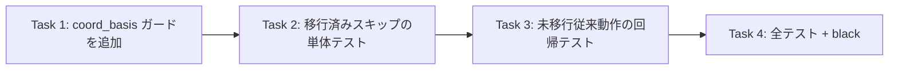

# Issue #40: 実装タスク一覧

## 優先順位・依存関係



**実装順序（推奨）**: Task 1 → Task 2 → Task 3 → Task 4（全テスト・整形）

**実装の中心は `structural_parser.py` 1箇所**。`process_input_json` が画像OCR / watcher 両経路から
呼ばれる共通の `ExtractionService` を使うため、1箇所の修正で両経路に適用される。

---

## Task 1: `_apply_template_corrections()` に coord_basis ガードを追加

**優先度: 高** — 誤上書き防止の中核

### 変更内容

`app/structural_parser.py` の `_apply_template_corrections()`（現行 143-155 行のテンプレート適用ブロック）に、
`coord_basis == 'date'` のとき座標ベースのフィールド上書きをスキップするガードを追加する。

```python
# Before (142-155行)
            # テンプレート適用
            if template and matched_clinic_name:
                coords = template.get("coords_corrections")
                if coords:
                    ocr_entries = self._get_ocr_entries(ocr_json)
                    if ocr_entries:
                        proximity_texts = search_fields_by_proximity(
                            ocr_entries,
                            coords,
                            threshold=DEFAULT_PROXIMITY_THRESHOLD,
                        )
                        for field_name, concat_text in proximity_texts.items():
                            if concat_text and field_name in extracted:
                                extracted[field_name] = concat_text

                # 正しいクリニック名で上書き
                if matched_clinic_name != clinic_name:
                    extracted["clinic"] = matched_clinic_name
```

```python
# After
            # テンプレート適用
            if template and matched_clinic_name:
                coord_basis = template.get("coord_basis") or "topmost"
                # 移行済み（date 基準）の template は topmost 基準の raw に照合できないため、
                # 座標ベースのフィールド上書きをスキップする（Issue #40, 案B 粒度1）。
                # 誤上書き防止が目的。値はテキスト抽出（LLM）にフォールバック。
                if coord_basis != "date":
                    coords = template.get("coords_corrections")
                    if coords:
                        ocr_entries = self._get_ocr_entries(ocr_json)
                        if ocr_entries:
                            proximity_texts = search_fields_by_proximity(
                                ocr_entries,
                                coords,
                                threshold=DEFAULT_PROXIMITY_THRESHOLD,
                            )
                            for field_name, concat_text in proximity_texts.items():
                                if concat_text and field_name in extracted:
                                    extracted[field_name] = concat_text

                # 正しいクリニック名で上書き（③）は coord_basis に関係なく常に実行
                if matched_clinic_name != clinic_name:
                    extracted["clinic"] = matched_clinic_name
```

### 注意点
- `coord_basis` が None（旧データ）なら `or "topmost"` で従来動作を維持。
- ③（clinic 名上書き）と④（新規 clinic 作成）はガードの外に残し、移行済みでも動作させる。
- テスト対象は `process_input_json` 経由（`ExtractionService` を共通で使うため 1 修正で両経路）。

**変更ファイル**: `app/structural_parser.py`

---

## Task 2: 移行済み（date 基準）でスキップされる単体テスト

**優先度: 高** — 受入条件1・2の検証

### 変更内容

`tests/test_structural_parser.py` に、`coord_basis='date'` の template を持つ clinic では
座標上書きが走らないことを確認するテストを追加。

```python
def test_template_based_extraction_skipped_when_date_basis(
    self, temp_output_dir: Path, temp_db: Path
):
    """coord_basis='date' の template では座標によるフィールド上書きがスキップされる。"""
    # date 基準へ移行済みの clinic + template を作成
    from app.db import get_or_create_clinic
    from app.db import get_db_connection

    clinic_id = get_or_create_clinic(temp_db, "あおばクリニック")
    template_id = str(uuid.uuid4())
    upsert_template(
        temp_db,
        template_id,
        clinic_id,
        version=1,
        coords_corrections={
            "amount": [[400, 300], [480, 300], [480, 340], [400, 340]],
            "date": [[50, 50], [200, 50], [200, 80], [50, 80]],
        },
    )
    # coord_basis を 'date' に更新（#39 移行済みを模擬）
    with get_db_connection(temp_db) as conn:
        conn.execute("UPDATE templates SET coord_basis = 'date' WHERE id = ?", (template_id,))

    raw_path = temp_output_dir / "receipt-001.json"
    # ↑ このテストでは、date 基準の template 座標と topmost 基準の raw が「うまく一致してしまい
    #   誤上書きする」ケースを用意する（例: 座標が raw の別フィールド位置に近い）。
    # ここでは単純に、amount 座標が raw の「3,800」と一致し得る配置のまま、
    # ガードがあれば amount が上書きされないことを確認する。
    result = process_input_json(raw_path, model="mock", output_dir=temp_output_dir, db_path=temp_db)

    assert result is not None
    # date 基準 template は coords_corrections を参照しないため、
    # amount はテキスト抽出（mock）の結果 3800 のまま（座標上書きで 9999 等に変化しない）。
    assert result["amount"] == 3800
```

**注意点**: テストでは「date 基準 template の座標が、raw の別フィールド位置に誤マッチし得る」ことを
想定するのが理想。ただし逆に「date 移行済みなら正しく相対化された raw にだけ座標が合う」前提だと
スキップの効果を観測しにくい。実装時は次のどちらかで検証すること:
- 案: raw の SAMPLE に対し、date 基準 template 座標をあえて「別フィールドに近い位置」に配置して
  誤上書きが起きるはずの状況を作り、ガードでそれが起きないことを確認。
- 案: `_get_ocr_entries` / `search_fields_by_proximity` をモックして、date 基準時に呼ばれないことを直接断言。

**変更ファイル**: `tests/test_structural_parser.py`

---

## Task 3: 未移行（topmost 基準）は従来動作の回帰テスト

**優先度: 中** — 受入条件4の検証

### 変更内容

`tests/test_structural_parser.py` に、`coord_basis='topmost'`（デフォルト）の template では
従来どおり座標上書きが働くことを確認するテストを追加。

```python
def test_template_based_extraction_works_for_topmost_basis(
    self, temp_output_dir: Path, temp_db: Path, seed_clinic_with_template: str
):
    """未移行（topmost）の template では従来どおり座標上書きが動作する。"""
    raw_path = temp_output_dir / "receipt-001.json"
    result = process_input_json(raw_path, model="mock", output_dir=temp_output_dir, db_path=temp_db)

    assert result is not None
    # 既存の test_template_based_extraction_override と同様、amount が template 座標で 9999 に上書きされる
    # （ただし seed fixture の coords に応じて期待値は実装時に合わせる）
    assert result["amount"] in (3800, 9999)  # ← seed に依存。実装時は正確な値に固定
```

**注意点**:
- `seed_clinic_with_template` fixture（既存）の coords 内容を確認し、期待値を正確に固定する。
- 既存の `test_template_based_extraction_override` がこのケースを実質カバーしているはずなので、
  あればそれを活かし、最小追加で良い。

**変更ファイル**: `tests/test_structural_parser.py`

---

## Task 4: 全テスト + black 整形 + 確認

**優先度: 中** — 受入条件5

### 実行手順

```bash
# 対象単体
uv run pytest tests/test_structural_parser.py -v

# 全テスト（既存 + 追加）
uv run pytest tests/ -q

# 整形
uv run black --check app/structural_parser.py tests/test_structural_parser.py
```

### 期待結果
- `test_structural_parser.py` の追加テストがパス。
- 全テストで**新規の失敗が増えない**こと。
  - 既存の `TestRunOcr::test_calls_process_image_and_logs` は既知の事前失敗（base でも同様）で、
    本修正とは無関係。
- black チェックで `structural_parser.py` / `test_structural_parser.py` がクリーン。

### コミット（実装時・ユーザー確認後）
```bash
git add app/structural_parser.py tests/test_structural_parser.py
git commit -m "fix #40: date 基準移行後の前方テンプレート補正の誤上書きを防止"
```

---

## ファイル変更サマリ

| ファイル | Task | 変更種別 | 変更規模 |
|---------|------|---------|---------|
| `app/structural_parser.py` | 1 | 修正（ガード追加） | ~6行 |
| `tests/test_structural_parser.py` | 2,3 | 修正（テスト追加） | ~40行 |