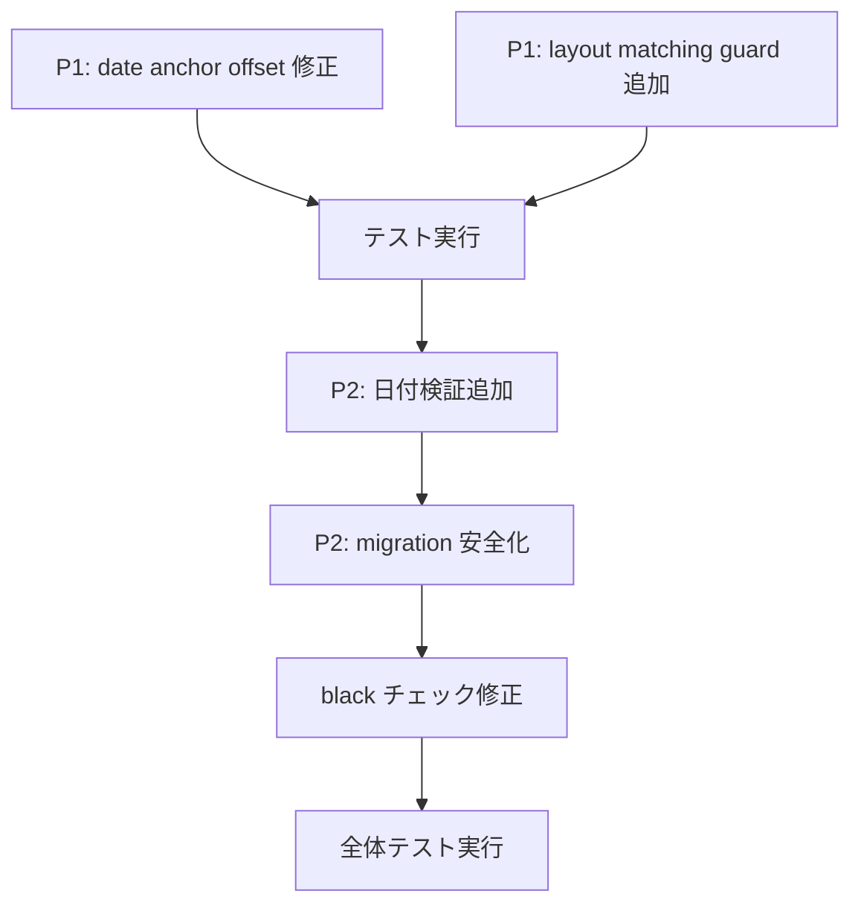

# PR #41 Review 改善計画 — 全体概要

## 目的

PR #41（Issue #39 date 基準座標正規化 / Issue #40 基底不一致修正）のレビュー指摘事項に対し、各課題に対する改善計画を作成し、実装へ移行する。

## 改善対象課題

| 優先度 | 課題 | ファイル |
| ------ | ---- | -------- |
| P1 | 初回 anchor の offset 座標系誤り | [`task_01_date_anchor_offset_fix.md`](task_01_date_anchor_offset_fix.md) |
| P1 | layout matching 経由での date-basis template 誤上書き | [`task_02_layout_matching_date_basis_guard.md`](task_02_layout_matching_date_basis_guard.md) |
| P2 | parse_date の暦妥当性未検証 | [`task_03_date_validation_anchor.md`](task_03_date_validation_anchor.md) |
| P2 | SQLite migration の並列初期化競合 | [`task_04_migration_parallel_safety.md`](task_04_migration_parallel_safety.md) |
| - | black チェック修正 | [`task_05_black_check_fix.md`](task_05_black_check_fix.md) |

## 実装順序

1. **P1課題から着手**: 両P1課題はdate anchor機能の中核不整合であり、修正前のマージは推奨しない
2. **P2課題対応**: 日付検証とmigration安全化を追加
3. **コード品質**: blackチェックを成功状態に維持
4. **全体検証**: 全テストパス確認

## 関連ファイル

- レビュー報告: `.github/reports/pr-41-review.md`
- Issue #39: `tasks/issue_39/`
- Issue #40: `tasks/issue_40/`
- 仕様: `specs/2026-10-06-spec.md`, `specs/2026-10-08-spec.md`
- 実装: `app/date_anchor.py`, `app/structural_parser.py`, `app/db.py`, `app/db_migrations.py`, `app/normalization.py`
- テスト: `tests/test_date_anchor.py`, `tests/test_migrations.py`, `tests/test_structural_parser.py`, `tests/test_coord_search.py`

## 受入条件

- [ ] P1: 初回anchor移行後、date box左上が(0,0)に揃う
- [ ] P1: layout matching経由でdate-basis templateがフィールド補正へ渡らない
- [ ] P2: 無効な日付がanchorとして採用されない
- [ ] P2: 並列初期化時にduplicate columnエラーが発生しない
- [ ] black `--check` が全テストファイルで成功
- [ ] 全テスト `pytest tests/ -q` が成功（既知の1失敗は除く）
